# Willow git-shaped state machine — fleet policy

**b17:** WLGSM · ΔΣ=42  
**Status:** Ratified (process canon — implement features *through* these transitions)  
**Owner:** sean + hanuman  
**Refs:** `willow/fylgja/powers/agent-rails.md`, `willow/fylgja/skills/startup.md`, `docs/superpowers/specs/2026-04-22-fylgja-design.md`

---

## 1. Why this exists

Willow has many legitimate planes (Grove, KB, SOIL, handoffs, ledger, Kart, SAFE). Without a **single shared shape**, work feels like “many tabs” — open loops multiply and “done” is ambiguous.  
This document imports **Git’s collaboration model** as Willow’s **organic default**: every meaningful change is **proposed → checked → reviewed → merged** (or explicitly archived), never anonymously overwritten.

---

## 2. Canonical state machine (Git × Willow)

Same lifecycle, two columns. **Agents and humans move work along the Willow column**; the Git column is the mental reference.

| # | **Git shape** | **Willow shape (where truth lives)** |
|---|----------------|--------------------------------------|
| 0 | *(optional)* **Issue** — problem / intent exists | **SOIL flag**, **dispatch_tasks**, **Grove thread opener**, or **KB search miss** — something is *tracked* and named (subject line quality). |
| 1 | **Draft PR** — idea exists, not ready for trunk | **`willow_fork_create`** / worktree / Nest **staged** / Jeles **`.tmp`**. No KB ratification; no “this is fleet policy” claims. |
| 2 | **Open PR** — ready for evidence | **Grove intent post** + **KB seed atom** (non-derivable contract) **or** linked fork card — “please review this bounded change.” |
| 3 | **Checks** — automation proves basics | **`willow_task_submit`** (Kart), **`pytest` / CI**, **`willow_memory_check`** before ingest, **SAFE gate** for tool paths — *evidence*, not vibes. |
| 4 | **Review** — maintainer / owner gate | **Sean ratification**, **`willow_nest_file` confirm**, **Professor / route owner**, **cross-repo Grove ACK** (wait policy per fleet rules). |
| 5 | **Merge to main** — trunk updated | **`willow_fork_merge`** / **merge to `master`** / **`willow_knowledge_ingest`** of ratified decision / **`willow_ratify`** / **`store_update`** closing flags with resolution. **One verb = one closure event.** |
| 6 | **Release note** (optional) | **`willow_frank_ledger_write`** milestone / **KB atom** summary for operators / **Grove `#architecture`** when the fleet should notice. |
| 7 | **Archive** — read-only history | **KB `domain='archived'`**, **SOIL soft-delete + audit**, **closed issues** — **never hard-delete** without Sean. |

### Diagram (same transitions)

```mermaid
stateDiagram-v2
  direction LR

  state "0 · Issue\n(flag / dispatch / thread)" as Issue
  state "1 · Draft PR\n(fork / worktree / .tmp)" as Draft
  state "2 · Open PR\n(grove + KB seed)" as Open
  state "3 · Checks\n(kart / tests / memory_check)" as Checks
  state "4 · Review\n(sean / nest / owner)" as Review
  state "5 · Merge\n(ingest / ratify / master)" as Merge
  state "6 · Release note\n(ledger / kb / arch)" as Release
  state "7 · Archive\n(domain archived / audit)" as Archive

  [*] --> Issue
  Issue --> Draft: capture intent
  Draft --> Open: bounded + linkable
  Open --> Checks: evidence run
  Checks --> Review: green / flagged for human
  Review --> Merge: ratified
  Merge --> Release: optional broadcast
  Merge --> Archive: superseded later
  Release --> Archive: time passes
```

---

## 3. Hard rules (anti-chaos)

1. **No “merge” without an “open PR”** — do not ingest ratified-sounding atoms or change trunk behavior from chat alone; there must be a **named bounded object** (fork, PR, Nest item, or ticketed flag) first.  
2. **No skipping checks** when the change touches permissions, persistence, or multi-agent contracts — `willow_memory_check` / tests / SAFE as applicable.  
3. **One closure verb** — when you finish, use the vocabulary that matches the layer (don’t “Grove ACK” and also leave flags `running` without meaning).  
4. **Archive ≠ delete** — supersede in KB, soft-delete in SOIL, keep audit trail.  
5. **Pull before push** — same as “fetch before merge”: **Grove history / KB search** before posts that could duplicate another agent’s PR.

---

## 4. New-feature gate (every addition answers this)

Before landing a new automation, tool, or channel, fill one row:

| Question | Answer required |
|----------|-----------------|
| Which **state** (0–7) does this add or move? | e.g. “Adds Check step via new Kart worker” |
| What is the **Open PR** equivalent? | e.g. “Grove `#architecture` + KB seed id” |
| What is **Merge**? | e.g. “Ingest + ledger line” |
| What is **Archive**? | e.g. “Atom domain archived when superseded” |

If you cannot name those, the feature is **not git-shaped yet** — refine before shipping.

---

## 5. ADHD / spectrum alignment (why this policy)

Explicit **states**, **one trunk**, **visible diffs**, **recoverable history** reduce “where did I put that?” and “was that actually done?” — the same properties that make **git** legible to people who think better in **graphs and contracts** than in implicit social flow. Willow adopts that **as behavior**, regardless of which UI (Cursor, TUI, MCP) sits on top.

---

## 6. Non-goals

- **Not** replacing Grove/KB with GitHub Discussions or GitHub Projects.  
- **Not** requiring every micro-edit to open a literal GitHub PR — **worktrees + small commits** still count as *draft PR* territory; the **shape** matters more than the host.

---

## 7. Reference implementation

Runnable **state machine + JSON store + CLI + tests** live under **`sandbox/`** in `willow-1.9`:

- Policy binding and rollout: `sandbox/docs/IMPLEMENTATION_SPEC.md`
- Operator README: `sandbox/README.md`
- Tests: `tests/test_sandbox/test_git_shaped.py`

---

*When this doc and reality diverge, update the doc or fix the fleet — silent drift is the only failure mode that matters.*
