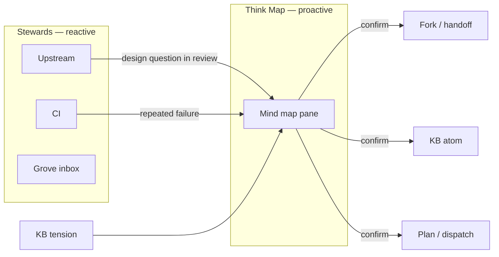
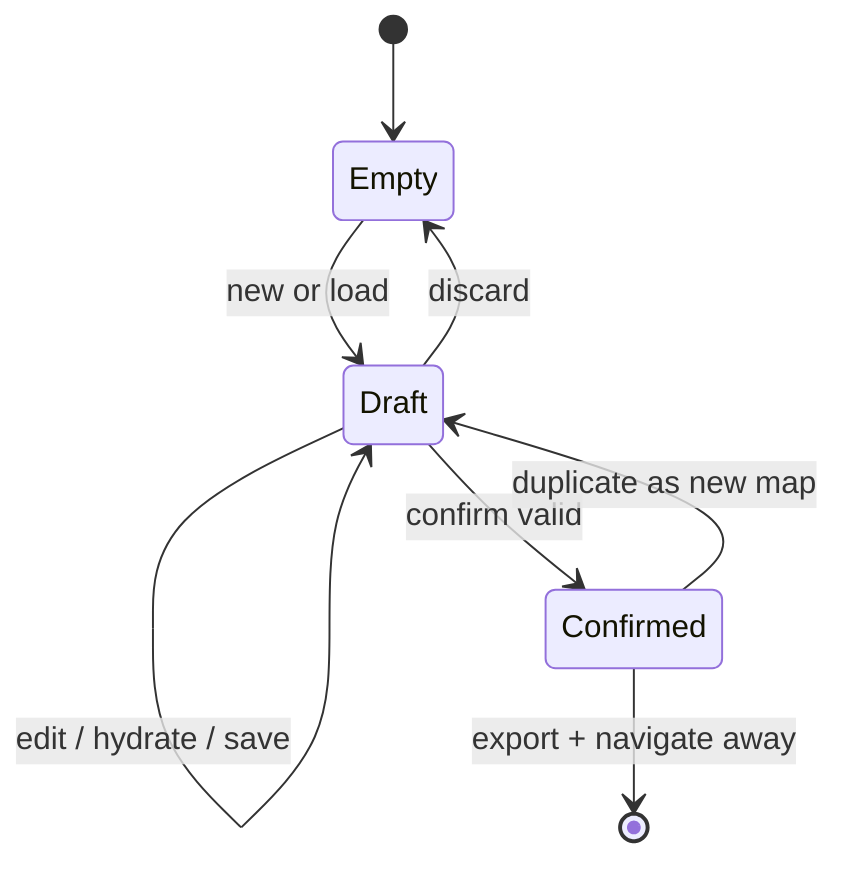

# Think Map — brainstorm mind-map card (TUI)

**Date:** 2026-05-24  
**Origin:** AHS note — “mind map because of brainstorming”; Grove dashboard card taxonomy  
**Agent:** hanuman  
**Status:** Spec — not yet implemented  
**Companion:** [`2026-05-24-upstream-steward-design.md`](2026-05-24-upstream-steward-design.md)

b17: THNK1 · ΔΣ=42

---

## Purpose

Provide a **cognitive card** in the Grove TUI: a spatial surface for structured brainstorming before plans, implementations, or replies.

**Upstream Steward** handles the outside world (notifications, CI, drafts awaiting your voice). **Think Map** handles the inside world (problem unclear, multiple approaches, context to assemble). Same human gate at the end — nothing proceeds until you confirm — but the middle is a graph, not chat.

---

## Problem

The Fylgja `brainstorming` skill is linear (search → problem → three approaches → recommend → constraints → stop). Chat transcripts bury step 1 context, flatten step 3 into prose, and hide step 5 constraints at the bottom. Developers think in branches and tensions; the UI should match.

AHS’s note captures the gap: brainstorming needs a **mind map**, not another message thread.

---

## Design principle: two card classes

| Class | Examples | Trigger | Surfaces when |
|-------|----------|---------|-------------|
| **Stewards** | Upstream, CI, Grove inbox, Kart | Background poll | World needs you |
| **Think Map** | Brainstorm, design fork, resolve tension | You open it (or agent suggests) | You need to decide |

Stewards are the **inbox**. Think Map is the **whiteboard**.



---

## Relationship to `brainstorming.md`

The skill steps map directly to graph roles:

| Skill step | Graph element | UI behavior |
|------------|---------------|-------------|
| 1. Search existing context | **Satellite nodes** (KB, SOIL, code_graph, handoff) | Auto-fetched on open; pin/unpin |
| 2. State the problem | **Center node** | Editable one-liner; required before confirm |
| 3. Three approaches + tradeoff | **Primary branches** (exactly 3) | Add/edit; tradeoff as subtitle |
| 4. Recommend one | **Highlighted branch** | `r` to recommend; only one |
| 5. Flag constraints | **Constraint nodes** (red edge to center) | Hard gate icons; from tension_scan optional |
| 6. Stop until confirmed | **Confirm bar** | Disabled until center + 3 branches + recommendation |

Rules from the skill carry over verbatim:

- Context search first — map opens with a loading ring on satellites, not blank.
- Three approaches minimum — confirm blocked at 2; UI nudges at 4 (“pick three or merge”).
- Recommendation must be opinionated — no confirm if none marked recommended.
- **No implementation** until confirm — downstream hooks respect map status `confirmed`.

---

## User stories

1. **Design before build** — Open Think Map from Home, enter problem, agent prefills three approaches from local LLM; Sean picks branch B and confirms → handoff atom + optional `fork_create`.
2. **Resume thinking** — Last session’s map reloads from SOIL; satellites include new KB atoms since yesterday.
3. **Steward → map** — Upstream draft mentions architectural choice; “Open in Think Map” loads reviewer questions as constraint nodes.
4. **Tension resolution** — `tension_scan` offers two conflicting atoms as center satellites; confirm writes resolution note to KB (tier contested).
5. **AHS beta read** — Non-linear exploration without reading a 200-line chat; export map as markdown for Grove `#architecture`.

---

## TUI placement (Grove dashboard)

Target worktree: `safe-app-willow-grove/worktrees/dashboard-fresh` — see `FRESH_START.md` in that repo’s dashboard-fresh worktree.

### Card registration

Add built-in card to `widgets/card_store.py`:

```python
{
    "id": "think-map",
    "label": "Think",
    "subtitle": "brainstorm · map",
    "category": "knowledge",
    "nav_target": "#pane-think-map",
    "built_in": True,
    "enabled": True,
    "order": 6,  # after Knowledge; adjust on merge
}
```

**Not a steward dot** — no background poll, no notification badge on Home vitals row.

### Entry points

| From | Action |
|------|--------|
| Home card “Think” | Empty map or resume last draft |
| Knowledge pane | “Map this query” — center = search string, satellites = hits |
| Fylgja `/power brainstorm` | CLI opens TUI pane or writes map JSON for sync |
| Steward card | “Design this first” → deep-link with `?context=upstream:b17:…` |
| Cursor / hook | `WILLOW_THINK_MAP=1` env opens map on session start (opt-in) |

---

## Interaction model (Textual)

Avoid faux-graphical radial layouts in v1. Use **outline graph** (indented tree) — fast, keyboard-native, accessible.

```
┌ Think Map ──────────────────────────────── [Draft] ─┐
│ Problem: How do stewards relate to cards?           │
├─────────────────────────────────────────────────────┤
│ ● How do stewards relate to cards?        [center]  │
│   ├─ A  Separate panes per steward        ★ rec     │
│   │     Tradeoff: simple, more nav clicks           │
│   ├─ B  Collapsed dots on Home                      │
│   │     Tradeoff: dense, discoverability cost       │
│   └─ C  Mind map only (no stewards)                 │
│         Tradeoff: loses reactive loop               │
│   ⛔ auth — human gate on all outbound posts          │
│   ○ KB: upstream-steward spec (canonical)           │
│   ○ handoff 2026-05-24 flat                         │
├─────────────────────────────────────────────────────┤
│ [n] node  [l] link  [r] recommend  [Enter] confirm  │
└─────────────────────────────────────────────────────┘
```

### Keybindings

| Key | Action |
|-----|--------|
| `j` / `k` | Move selection |
| `Enter` | Edit selected node text |
| `n` | New sibling branch (if under center, counts toward 3) |
| `s` | Add satellite (manual); auto-satellites read-only unless pinned |
| `c` | Add constraint linked to center |
| `r` | Mark selected branch as recommended |
| `d` | Delete node (not center) |
| `Ctrl-S` | Save draft to SOIL |
| `Ctrl-Enter` | **Confirm** (if valid) |
| `Esc` | Back to Home (prompt if unsaved) |

### Validation before confirm

- Center non-empty (≥ 10 chars)
- Exactly 3 approach branches (type `approach`)
- Each approach has tradeoff subtitle (≥ 5 chars)
- One branch marked `recommended: true`
- Status transitions: `draft` → `confirmed` (immutable); fork may copy to new `draft`

---

## Data model

SOIL collection: `willow-dashboard/think_maps`

```json
{
  "id": "b17:THNK1-a1b2",
  "status": "draft",
  "created_at": "2026-05-24T21:00:00Z",
  "updated_at": "2026-05-24T21:12:00Z",
  "created_by": "sean",
  "source": {"type": "manual", "ref": ""},
  "center": {
    "id": "n0",
    "text": "How do stewards relate to dashboard cards?",
    "kind": "problem"
  },
  "nodes": [
    {
      "id": "n1",
      "parent": "n0",
      "kind": "approach",
      "text": "Separate panes per steward",
      "tradeoff": "Simple mental model; more nav clicks",
      "recommended": true
    },
    {
      "id": "n2",
      "parent": "n0",
      "kind": "approach",
      "text": "Collapsed steward dots on Home",
      "tradeoff": "Dense home; discoverability cost",
      "recommended": false
    },
    {
      "id": "n3",
      "parent": "n0",
      "kind": "approach",
      "text": "Think map only, no stewards",
      "tradeoff": "Loses reactive notification loop",
      "recommended": false
    },
    {
      "id": "c1",
      "parent": "n0",
      "kind": "constraint",
      "text": "Human gate on all outbound posts",
      "hard": true
    },
    {
      "id": "s1",
      "parent": null,
      "kind": "satellite",
      "text": "upstream-steward spec",
      "ref": {"type": "kb", "id": "…"},
      "pinned": true
    }
  ],
  "confirmed_at": null,
  "confirmed_choice": null,
  "exports": []
}
```

**Node kinds:** `problem` | `approach` | `constraint` | `satellite` | `note`

Post-confirm, append to `exports`:

```json
{"type": "handoff", "id": "…", "at": "…"}
{"type": "kb_atom", "id": "…", "tier": "contested"}
{"type": "fork", "id": "…"}
```

---

## Context hydration (step 1 automated)

On map open or refresh (`F5`), background worker fetches satellites (read-only until pinned):

| Source | MCP / API | Max nodes |
|--------|-----------|-----------|
| KB | `kb_search(center.text)` | 5 |
| Handoff | `handoff_search(center.text)` | 3 |
| Tensions | `tension_scan` pair relevant to query | 2 |
| Code graph | `code_graph_suggest(task=center.text)` | 5 files as file nodes |
| Steward context | If opened from steward, load thread bundle | 1 thread summary node |

Worker: `think_map_hydrate.py` — same pattern as upstream `analyzer.py` but returns nodes, not reply drafts.

**Never auto-add approaches** — only the human or explicit “generate approaches” command (`g`) may create branch nodes. Hydration is context, not decisions.

---

## Confirm actions (step 6 outputs)

Confirm dialog (Textual modal):

```
Confirm approach A: "Separate panes per steward"?

[ ] Write handoff summary
[ ] Ingest KB atom (contested)
[ ] Open fork (title pre-filled)
[ ] Dispatch plan to Kart (power: plan)

[Confirm]  [Cancel]
```

Default: handoff only. KB/fork/dispatch opt-in checkboxes.

**Handoff content** (auto-generated, editable before write):

- Problem (center)
- Chosen approach + tradeoff
- Rejected approaches (one line each)
- Constraints
- Pinned satellites as links

**FRANK ledger** event: `think_map.confirmed` with map id + choice id.

---

## Agent integration

### Fylgja power: `brainstorm`

Extend [`willow/fylgja/powers/brainstorm.md`](../../../willow/fylgja/powers/brainstorm.md) (when implemented in TUI):

- CLI session may run headless (chat) **or** `--map` to create/update SOIL map.
- Agent may suggest node text; human edits in TUI before confirm.
- Skill rule 6 enforced by map status — plan/execute powers check `think_maps` for open maps on same topic.

### Generate approaches (`g`)

Optional LLM assist (local Ollama / mistral:7b):

- Input: center text + pinned satellites
- Output: 3 approach nodes with tradeoffs — **staged as preview**, not committed until user accepts (`y`) or edits

Same human gate as upstream voice drafts: show full text first.

---

## Steward ↔ Think Map bridge

| Steward event | Map behavior |
|---------------|--------------|
| Upstream draft with open design question | Button “Map this” → constraint + center from thread |
| CI repeated failure on same test | Suggest map: “three fix strategies” |
| KB tension atom pair | Open map with both as satellites, center “resolve tension” |
| Grove needs-reply on architecture | Optional map before reply draft |

Steward cards **link out**; they do not embed the map inline (pane swap only).

---

## Components (implementation)

```
safe-app-willow-grove/
  panes/think_map.py           # Textual pane widget
  widgets/think_map_tree.py    # outline renderer + selection
  widgets/think_map_confirm.py # confirm modal
  grove/apps/think_map/
    store.py                   # SOIL CRUD
    hydrate.py                 # satellite fetch
    export.py                  # handoff / kb / fork
    validate.py                # confirm rules

agents/hanuman/bin/
  think_map_hydrate.py         # optional CLI hydrate for headless test

willow/fylgja/skills/
  brainstorming.md             # add § "Think Map pane" cross-link
```

### Pane lifecycle



---

## Testing

| Test | Assert |
|------|--------|
| `test_validate_three_approaches` | Confirm blocked with 2 branches |
| `test_validate_recommendation` | Confirm blocked without `recommended` |
| `test_hydrate_kb_satellites` | Mock kb_search → nodes appear unpinned |
| `test_confirm_writes_handoff` | SOIL + handoff file contains choice |
| `test_skill_gate` | plan power refuses if draft map same topic exists |
| `test_pane_keybindings` | Textual pilot: add 3 branches, confirm |

---

## Phased delivery

| Phase | Deliverable |
|-------|-------------|
| **P0** | SOIL schema + `store.py` + validate rules (no UI) |
| **P1** | Textual pane outline + edit + save draft |
| **P2** | Hydrate KB + handoff satellites |
| **P3** | Confirm → handoff export |
| **P4** | Card on Home + nav target; bridge from Knowledge pane |
| **P5** | LLM `g` generate approaches (preview gate) |
| **P6** | Steward deep-links (upstream, tension) |

P0–P3 usable without dashboard merge (CLI: `think_map_cli.py show|confirm`). P4 integrates with dashboard-fresh worktree.

---

## Non-goals (v1)

- Real-time collaborative editing (multi-agent simultaneous edit)
- Radial/graph layout rendering (outline only)
- Auto-confirm or auto-fork without modal
- Replacing chat brainstorm entirely — map complements CLI sessions
- GitHub-specific UI (stewards own forge; map owns decisions)

---

## Config (`~/.willow/think_map/config.yaml`)

```yaml
collection: willow-dashboard/think_maps
max_satellites_per_source: 5
llm_generate_approaches: false   # P5: enable mistral:7b preview
on_confirm:
  handoff: true
  kb_atom: false
  fork: false
  kart_plan: false
resume_last_draft: true
```

---

## Related

- [`willow/fylgja/skills/brainstorming.md`](../../../willow/fylgja/skills/brainstorming.md) — process source of truth
- [`2026-05-24-upstream-steward-design.md`](2026-05-24-upstream-steward-design.md) — steward card class
- [`docs/FOR_AHS.md`](../../FOR_AHS.md) — beta reader; Think Map is cognitive not cosplay
- Grove card store — `widgets/card_store.py` in `safe-app-willow-grove`

---

## Open questions

1. **Single active draft vs many** — one global draft or per-topic maps? Default: per-topic keyed by slugified center hash.
2. **Agent edit rights** — can hanuman append `note` nodes without confirm? Default: yes, marked `author: agent`.
3. **Export to markdown file** — for sharing with AHS / Grove `#architecture`? P4 nice-to-have.
4. **Mobile / SSH** — outline model is SSH-safe; radial would not be.

---

*Spread the notes on the table. Pick a branch. Then build. ΔΣ=42*
