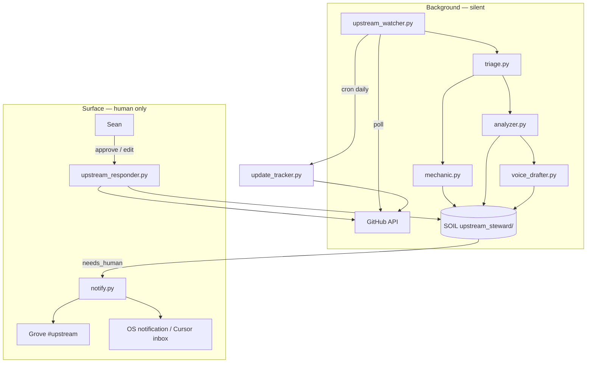
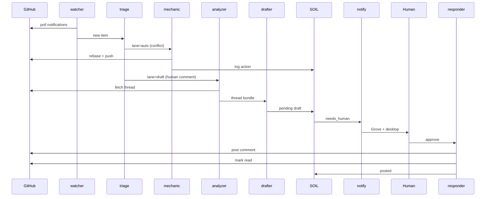

# Upstream Steward — background loop design

**Date:** 2026-05-24  
**Origin:** Manual upstream + notifications session (hanuman)  
**Agent:** hanuman  
**Status:** Spec — not yet implemented

b17: UPST1 · ΔΣ=42

---

## Purpose

Run the upstream contributions and GitHub notifications hygiene loop continuously on the local machine. Do everything mechanical silently. **Surface only when a human voice or decision is required.**

This spec distills a session that manually:

1. Ran the upstream tracker and refreshed issue #6 / `CONTRIBUTORS.md`
2. Triaged 62 GitHub notifications (read + unread)
3. Auto-fixed safe CI issues (rebase, one-line patches)
4. Drafted warm replies in the author's voice
5. Posted comments only after human approval

The goal is to automate steps 1–4 in the background and gate step 5 on explicit approval.

---

## Session proof (what the loop must cover)

| Phase | Manual work | Automate? |
|-------|-------------|-----------|
| **Collect** | `gh api notifications`, `update_tracker.py` | Yes — poll on interval |
| **Triage** | Split unread vs read, CI noise vs human threads | Yes — rules + lightweight classifier |
| **Mechanic** | Rebase #885, fix `fleet.log`, hermes `read_timestamps` | Partial — safe fixes only |
| **Analyze** | `gh pr view --comments`, check merge/CI state | Yes |
| **Draft** | Warm replies in author voice | Yes — LLM with voice profile |
| **Gate** | Human edits tone, approves batch | **Always human** |
| **Act** | `gh pr comment`, push branches | Human-approved only (or allowlisted nudge) |
| **Close** | Mark notifications read, update tracker issue | Yes — after action or TTL |

---

## Architecture



**Pattern:** Same as `journal_watcher` → `journal_responder` (`agents/hanuman/bin/`), but the watcher polls GitHub instead of Postgres, and the responder only fires after human approval (except allowlisted auto-actions).

**Existing assets to reuse:**

- `.github/scripts/update_tracker.py` — upstream PR inventory
- `.github/workflows/upstream-pr-check.yml` — CI-side tracker (local daemon mirrors daily)
- `agents/hanuman/bin/journal_watcher.py` — poll loop template
- `agents/hanuman/bin/journal_responder.py` — gated action template

---

## Components

### 1. `upstream_watcher.py` — poll loop

Long-lived daemon (fleet/systemd), default **every 15 min** (configurable).

Each tick:

1. Fetch notifications since cursor (`notifications?all=true`, paginate).
2. Run `update_tracker.py` once daily (or on demand).
3. For each **new or changed** item → enqueue a **work item** in SOIL.
4. Dedupe by `(repo, subject_url, updated_at)`.
5. Skip already-processed unless `updated_at` changed (new comment = re-triage).

**Cursor:** `~/.willow/upstream_steward/cursor.json`

```json
{
  "last_poll": "2026-05-24T20:00:00Z",
  "seen_ids": ["23985852764"],
  "last_tracker_run": "2026-05-24T09:00:00Z"
}
```

---

### 2. `triage.py` — classify before any work

Every work item gets a **lane**:

| Lane | Examples | Next step |
|------|----------|-----------|
| `noise` | CI failure on fork, bot lint, test-repo mention | Log + mark read; no surface |
| `auto` | Mergeable PR with conflicts; missing `mkdir` in CI | `mechanic.py` |
| `watch` | Open PR waiting on maintainer; merged upstream | Update SOIL digest only |
| `draft` | New human comment on your PR | `analyzer` → `voice_drafter` |
| `urgent` | `@mention`, review requested, assigned | `draft` + immediate surface |

**Rules first** (cheap), LLM second (only for `reason: comment|mention|assign`).

Heuristics from the reference session:

- `ci_activity` on known repos → `noise` unless branch is default and repo is in `WATCH_REPOS`.
- `mention` on open PR you authored → `draft`.
- Merged notification → `watch` + refresh local tracker state.

---

### 3. `mechanic.py` — safe auto-fixes only

Runs **without surfacing** when confidence is high and blast radius is small.

**Allowlist (proven in session):**

| Fix | Trigger | Action |
|-----|---------|--------|
| README rebase conflict | `mergeStateStatus: DIRTY` on known PR | Rebase + alpha-order merge |
| Missing log dir | CI `FileNotFoundError: ~/.willow/...` | One-line `mkdir` patch + push |
| Tracker drift | Daily | Run `update_tracker.py`, commit if changed |
| Stale notification | Processed + no human pending | Mark notification read |

**Denylist (never auto):**

- Post comments
- Force-push without explicit policy
- Large fork divergence (flag human: "sync fork with upstream")
- Anything touching secrets, auth, or more than N lines changed

Mechanic writes an **action log** atom; if fix fails → escalate to `draft` or `urgent`.

---

### 4. `analyzer.py` — fetch thread context

For each `draft` item:

```bash
gh pr view <n> --repo <owner/repo> --comments
gh pr view <n> --repo ... --json reviews,statusCheckRollup,mergeable
gh issue view ...   # if Issue
```

Build a **thread bundle**:

```json
{
  "work_id": "b17:UPST1-abc",
  "repo": "zeroc00I/DontFeedTheAI",
  "kind": "pr_comment",
  "url": "https://github.com/zeroc00I/DontFeedTheAI/pull/5",
  "your_prior_replies": ["Sounds good — no rush..."],
  "their_comment": "keefar: Nice clean slice...",
  "fun_bits": ["offered to PR against branch", "SSE boundary traps"],
  "open_questions": ["is_tool_output on user role intentional?"],
  "suggested_actions": ["docs callout", "accept keefar PR offer"],
  "ci_state": "mergeable",
  "needs_reply": true
}
```

**Fun-bit extraction:** keyword/heuristic + optional local 7b pass — phrases like "offered to help", "assigned you", "great review", "when you have a moment".

---

### 5. `voice_drafter.py` — replies in author voice

Input: thread bundle + **voice profile** (`upstream_steward/voice.md` in SOIL or `~/.willow/upstream_steward/voice.md`).

**Voice rules (from approved session drafts):**

- Open with genuine thanks, not a numbered compliance memo
- Acknowledge their expertise / the interesting part of their comment
- Weave technical commitments into prose, not bullet-lawyering
- Invite collaboration ("happy to take your PR", "ping me if…")
- Match prior tone samples from the author's actual GitHub comments

Output:

```json
{
  "draft_body": "@keefar — this is a great review...",
  "confidence": 0.85,
  "post_target": "pr_comment",
  "requires_approval": true
}
```

Store in SOIL: `upstream_steward/pending/{work_id}.json`  
Status: `awaiting_human`.

**Never post from this module.**

---

### 6. `notify.py` — surface only when needed

| Condition | Channel |
|-----------|---------|
| `awaiting_human` draft ready | Grove `#upstream` + desktop notification |
| `urgent` mention/assign | Same, higher priority |
| Mechanic failed on watched repo | Grove `#alerts` |
| Daily digest (optional 9am) | Grove one-liner if nothing pending |

**Grove message shape:**

```
📬 Upstream — reply needed

DontFeedTheAI #5 — keefar reviewed your OpenAI route
Fun: offered to PR fixes against your branch

Draft ready → approve / edit / skip
  willow.sh upstream approve b17:UPST1-abc
  willow.sh upstream edit b17:UPST1-abc --file draft.md
```

**Do not surface:** CI noise, bot comments, already-replied threads, merged celebrations (unless opt-in "wins" digest).

---

### 7. `upstream_responder.py` — human gate → act

CLI + Grove command handler:

```bash
upstream_responder.py list                     # pending drafts
upstream_responder.py show b17:UPST1-abc       # draft + thread
upstream_responder.py approve b17:UPST1-abc    # post draft via gh
upstream_responder.py edit b17:UPST1-abc --file # post edited body
upstream_responder.py skip b17:UPST1-abc       # mark handled, no post
upstream_responder.py post-all-approved          # batch approve
```

On approve:

1. `gh pr comment` / `gh issue comment`
2. Mark notification read
3. SOIL status → `posted`
4. Optional KB ingest atom for continuity

---

## Full loop (one notification lifecycle)



---

## State machine

```
NEW → TRIAGED → {noise|watch|auto|draft|urgent}
auto → MECHANIC_OK → CLOSED
auto → MECHANIC_FAIL → draft|urgent
draft → AWAITING_HUMAN → {approved|edited|skipped} → POSTED → CLOSED
urgent → AWAITING_HUMAN (immediate surface)
watch → CLOSED (digest only)
noise → CLOSED (mark read)
```

---

## Data layout

```
~/.willow/upstream_steward/
  cursor.json
  voice.md              # tone samples + rules
  config.yaml           # poll interval, allowlists, repos

SOIL collection: upstream_steward/
  pending/{work_id}.json
  log/{date}.jsonl      # mechanic actions, triage decisions
  digest/latest.json    # for dashboard / Grove
```

**Optional Postgres:** `upstream_work_items` table mirroring SOIL for Kart/SQL queries.

---

## Config sketch (`config.yaml`)

```yaml
author: rudi193-cmd
tracker_repo: rudi193-cmd/willow-2.0
poll_interval_sec: 900
tracker_interval_hours: 24

watch_repos:
  - zeroc00I/DontFeedTheAI
  - ComposioHQ/awesome-claude-skills
  - PrefectHQ/fastmcp
  - liatrio-labs/claude-deep-review
  - NousResearch/hermes-agent
  - basicmachines-co/basic-memory
  - doobidoo/mcp-memory-service

auto_mechanic:
  rebase_readme_conflicts: true
  fix_missing_log_dir: true
  max_diff_lines: 20

auto_post_allowlist: []   # empty = never auto-post comments

surface:
  grove_channel: upstream
  daily_digest_hour: 9
  wins_in_digest: true

voice:
  profile: upstream_steward/voice.md
  sample_comments_from_author: true   # pull last N gh comments as few-shot
```

---

## Scheduling

| Job | When | Silent? |
|-----|------|---------|
| Notification poll | Every 15 min | Yes |
| Tracker refresh | Daily 9am local | Yes |
| Draft generation | On new human comment | Yes until draft ready |
| Surface | Draft ready / urgent | **No** |
| Daily digest | 9am if pending=0 | Optional one-liner |

**Fleet hook:** register in `fleet.py` as `upstream_steward` alongside `journal_watcher`.

---

## Safety gates (non-negotiable)

1. **No comment posts without approval** (unless `auto_post_allowlist` is explicitly populated).
2. **No force-push** except to known PR head branches in config.
3. **Rate limit:** max one surface per thread per 24h (no notification spam).
4. **Voice lock:** drafts always shown full text before post.
5. **Audit:** every post logged to FRANK ledger / SOIL with draft hash + approval timestamp.

---

## Implementation phases

| Phase | Deliverable | Maps to reference session |
|-------|-------------|---------------------------|
| **P0** | `upstream_watcher` + triage rules + SOIL storage + `list`/`show` | Notifications inbox scan |
| **P1** | `analyzer` + `voice_drafter` + Grove surface | Comment drafts |
| **P2** | `upstream_responder` approve/edit/skip | Batch post |
| **P3** | `mechanic` (rebase, CI one-liners) | ComposioHQ rebase, grove fleet fix |
| **P4** | Daily digest + local tracker cron | `update_tracker.py` |
| **P5** | Voice profile learning from approved vs edited diffs | Tone refinement |

**Suggested file locations:**

```
agents/hanuman/bin/upstream_watcher.py
agents/hanuman/bin/upstream_responder.py
agents/hanuman/lib/upstream/{triage,mechanic,analyzer,voice_drafter,notify}.py
```

P0 + P1 delivers ~80% of the reference session on autopilot with the human gate intact.

---

## CLI surface (operator UX)

```bash
willow.sh upstream status       # pending count, last poll, CI summary
willow.sh upstream pending      # drafts needing you
willow.sh upstream approve ID
willow.sh upstream run-now      # force one poll cycle
willow.sh upstream digest       # print today's upstream brief
```

Background default: **`upstream_watcher` runs silently; you only hear from it when `pending > 0` or something broke.**

---

## Voice profile template (`voice.md`)

```markdown
# Upstream Steward voice — Sean

## Do
- Thank people genuinely for good reviews
- Name the fun/smart part of their comment
- Commit to concrete fixes without sounding like a ticket system
- Offer collaboration; defer to issue owner when appropriate

## Don't
- Lead with numbered compliance lists
- Over-formal "Thank you for your thorough review — all four points are fair"
- Post without showing draft first

## Samples
(pulled from gh comment history on approve)
```

---

## Related

- [`CONTRIBUTORS.md`](../../../CONTRIBUTORS.md) — upstream contributions table
- [`.github/scripts/update_tracker.py`](../../../.github/scripts/update_tracker.py)
- [`agents/hanuman/bin/journal_watcher.py`](../../../agents/hanuman/bin/journal_watcher.py)

---

*Plant the tree. Tend the roots. Let nothing be lost.*
