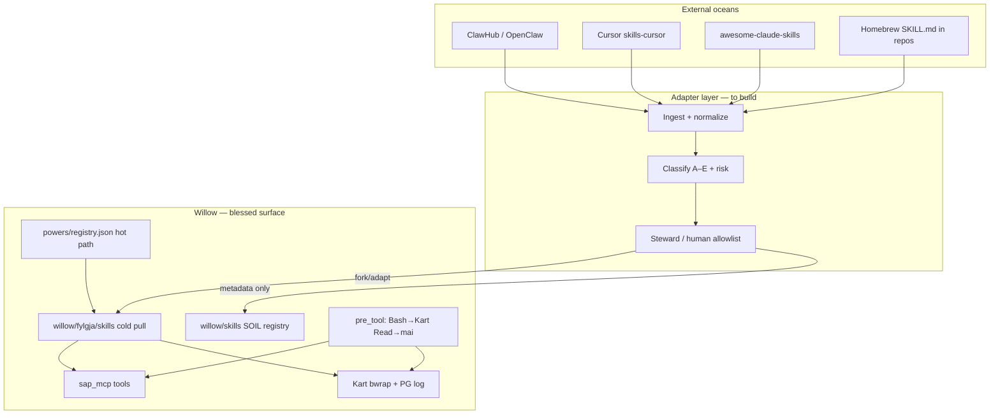

# Skill surface strategy — the world vs Willow

**Problem at scale:** There are not “a dozen Cursor skills.” There are **marketplaces** (ClawHub alone is thousands to tens of thousands of entries), **IDE packs** (Cursor `skills-cursor`, Claude plugins, Codex), **awesome lists** (Composio `awesome-claude-skills`, Hermes libraries), and **homebrew** `SKILL.md` trees in every repo. Most assume **foreground execution**: the agent stays in the thread for waits, polls, and long shell chains.

**Willow cannot audit 100,000 skills by hand.** It needs a **governance layer**: classify → gate → adapt → route execution (MCP / Kart / background wake).

---

## Three worlds (same shape, different hosts)

| World | Unit | Scale (order of magnitude) | Typical host |
|-------|------|----------------------------|--------------|
| **OpenClaw / ClawHub** | `SKILL.md` + YAML (`metadata.openclaw`) | 3k–40k+ public skills | `~/.openclaw/skills`, workspace `/skills` |
| **Cursor / Claude Code** | `SKILL.md` in `skills-cursor` or `.claude/skills` | Hundreds in catalogs; infinite homebrew | IDE agent session |
| **Willow Fylgja** | `willow/fylgja/skills/*.md` + **powers** router | ~30 blessed behaviors | Hooks + MCP + Kart |

**Common format:** Agent Skills–style folder, `SKILL.md`, frontmatter, prose instructions. That is good — one adapter can target many sources.

**Divergence:** What the skill **assumes** about tools (Bash vs MCP), **trust** (none vs SAP), and **time** (blocking vs background).

---

## Execution class (the axis that matters)

Every skill, native or imported, should be tagged with one **execution class**:

| Class | Meaning | Willow lane | Foreground? |
|-------|---------|-------------|-------------|
| **A — Data** | Read/search/write via APIs | Willow MCP (`kb_*`, `handoff_*`, `fleet_*`) | Short |
| **B — Shell burst** | One-shot `git`/`gh`/pytest | Kart `agent_task_submit` → `kart_task_run` | Short |
| **C — Watch / loop** | Poll CI, tail logs, cron | Background shell + sentinel (`loop` pattern) | **No** (wake only) |
| **D — Authoring** | Create hook/rule/skill file | `mai_write_file`, templates | Short |
| **E — Foreground saga** | Multi-step until done (legacy babysit) | ⚠️ Discourage — split into B + C | **Yes — problem child** |

**Rule:** External skills default to **E** until rewritten. Willow ships **A–D** only in `fylgja/`.

---

## Willow stack (what you already have)

| Layer | Role today | Gap |
|-------|------------|-----|
| **Powers** | Low-token routing (“use brainstorm, not 900-line skill”) | No mapping from external skill names |
| **Fylgja skills** | Boot, handoff, kart, babysit, … | Small curated set; not a marketplace |
| **SOIL `willow/skills`** | `skill_put` / `skill_list` / trigger match | No import pipeline from ClawHub |
| **SAP gate** | Tool permissions per app | Skills are not apps — need skill-level policy |
| **OpenClaw bridge** | `openclaw_mcp.py`, `openclaw_ingest.py` | Ingest transcripts/atoms, not skill vetting |
| **Upstream steward** | Watches `awesome-claude-skills` PRs | One repo; not ClawHub |

---

## Strategy: not “install skills” — **adopt capabilities**

### 1. Catalog (index, don’t copy)

- Maintain **`skill-catalog.jsonl`** (or SOIL collection): `id`, `source`, `url`, `execution_class`, `risk`, `willow_twin`, `status`.
- Sources: ClawHub API/search, `awesome-claude-skills` tree, `skills-cursor` manifest, Hermes lists.
- **Do not** vendor 40k SKILL.md into the repo.

### 2. Vet (automated + spot check)

Automated signals (you already care about security from CONTRIBUTORS / Lakera-class audits):

- `requires.bins` / env vars (over-provisioned OAuth patterns)
- Instruction regex: `gh pr checks --watch`, `while true`, `sleep`, `curl | bash`
- Missing `@markdownai` / frontmatter (optional for Willow twins)
- **ClawHub:** treat as **untrusted code**; never auto-install

### 3. Adapt (fork into Willow shape)

For skills worth keeping:

| External pattern | Willow adaptation |
|------------------|-------------------|
| Long Bash scripts | Kart `script_body` |
| CI babysit | `babysit.md` + background sentinel |
| Read many md files | `mai_read_file` |
| MCP mentioned generically | Map to `sap/mcp_registry.json` tool names |
| OpenClaw `metadata.openclaw.requires` | Translate to gate groups + env checklist |

Output: **`fylgja/skills/<name>.md`** (blessed) or **power stub** pointing to one paragraph.

### 4. Enforce (runtime)

Already partially there:

- `pre_tool` blocks Bash → Kart
- `pre_tool` blocks Write on `@markdownai` → `mai_write_file`
- MCP-first in session anchor

**Add (concept):**

- **Skill policy file** per agent: `allowed_execution_classes: [A,B,C,D]`, `deny_foreground_sagas: true`
- Hook on **Skill()** / skill load: if catalog says class **E**, inject “decompose using Willow babysit + loop”

### 5. Publish (optional twins upstream)

- OpenClaw PRs (you have history: `willow-memory-health`, `sap-enforcer`)
- Contribute **Willow-shaped** skills back to awesome-claude-skills
- Cursor: upstream is Cursor’s `skills-cursor` — local overrides + docs

---

## Native vs homebrew

| Type | Trust | Policy |
|------|-------|--------|
| **Native** (Cursor ship, OpenClaw bundled) | Signed-ish, versioned with product | Review on upgrade; diff manifest |
| **Homebrew** (random repo `skills/`) | Unknown | **Never auto-load**; catalog on first encounter; class E until vetted |
| **Willow Fylgja** | Fleet contract + hooks | Source of truth for this machine |

---

## Phased rollout (realistic)

| Phase | Deliverable | Outcome |
|-------|-------------|---------|
| **0** | Execution taxonomy + audit doc | Shared language (this doc + `SKILL_AUDIT_CURSOR_VS_WILLOW.md`) |
| **1** | `willow/skill-catalog.jsonl` — **50** high-value skills | babysit, loop, deploy, review, handoff, tdd, … with class + twin path |
| **2** | `scripts/skill_catalog_scan.py` — scan path, emit JSONL | `python scripts/skill_catalog_scan.py --write-seed` refreshes seed; full tree → 800+ rows |
| **3** | Steward hook: weekly ClawHub/awesome delta → Grove `#upstream` | Human triage queue, not auto-install |
| **4** | `skill_adopt.py` — import one SKILL.md → draft Fylgja + class | Semi-automated fork |
| **5** | Agent policy in `safe_agents` / manifest | Block class E at runtime |

**Not in scope:** Mirroring all of ClawHub. **In scope:** Willow becomes the **execution OS** that external skills must target.

---

## One-line thesis

> **The skill markdown is cheap; execution is expensive.** Willow owns execution (MCP, Kart, background wake, gate). The outside world supplies ideas — we adopt through catalog + adapt, not wholesale install.

---

## Related code

- `willow/fylgja/powers/registry.json` — hot router
- `willow/fylgja/skills/` — blessed behaviors
- `willow/skills.py` — SOIL registry
- `willow/skill-catalog.jsonl` — phase-1 seed catalog (50 skills)
- `scripts/skill_catalog_scan.py` — classify + index SKILL.md trees
- `sap/openclaw_ingest.py`, `sap/openclaw_mcp.py` — OpenClaw bridge
- `upstream_steward/` — watches `awesome-claude-skills`
- `docs/SKILL_AUDIT_CURSOR_VS_WILLOW.md` — local Cursor inventory

*2026-05-28*
