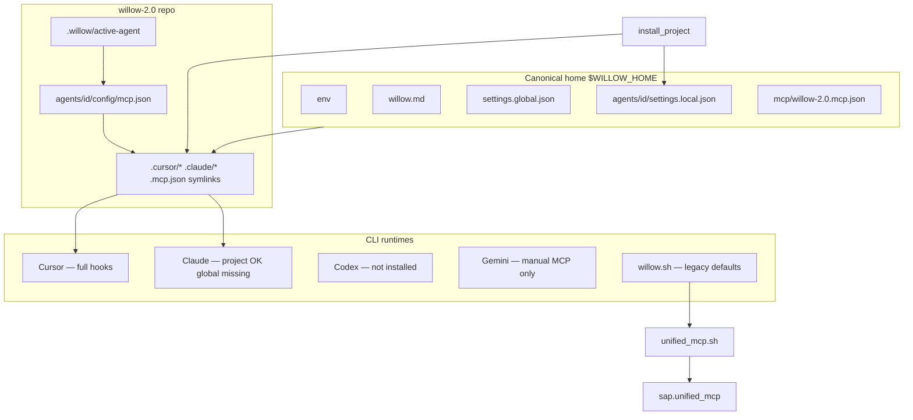

# Canonical Home & Runtime-Agnostic Agent Audit

**Date:** 2026-06-07  
**Agent:** hanuman (MCP caller)  
**Fork:** `FORK-4892CC08`  
**Branch / worktree:** `chore/canonical-home-audit` → `.claude/worktrees/chore-canonical-home-audit`  
**Mode:** Read-only diagnostic (no live config mutations)

> **Shipped (2026-06-07):** Remediation merged (#235), CI path-guard (#238), released `v2026.06.1`. Operator verify: `bash scripts/audit_canonical_home.sh` (0 failures) + `./willow.sh agents check --ide <surface>`. Findings below are the pre-ship snapshot; live docs now use `./willow.sh` and `$WILLOW_HOME`.

---

## Executive Summary

The **intended** model is correct and largely wired on this machine: private fleet config lives in **`~/github/.willow`** (`$WILLOW_HOME`), public code in **`~/github/willow-2.0`**, and IDE surfaces symlink into repo-local agent config. **`~/.willow`** resolves to the same place (alias OK).

The stack is **not yet runtime-agnostic in behavior**. Cursor is fully wired; Claude Code project wiring exists but **global Claude hooks are absent**; Codex and Gemini CLI have **no install path or hook parity**; launchers (`willow.sh`, `unified_mcp.sh`) still hardcode legacy paths and **conflicting default agent names**. Documentation and runtime code disagree on whether canonical home is `$WILLOW_HOME` or `~/.willow`.

**Verdict:** Local agents *can* use Willow today if they go through Cursor with `install_project` — but **behavior is not equal across CLIs** without additional wiring and a shared path resolver.

---

## Policy Baseline (ratified this session)

| Concept | Canonical | Alias |
|---------|-----------|-------|
| Private fleet home | `$WILLOW_HOME` → `~/github/.willow` | `~/.willow` (symlink) |
| Public code root | `$WILLOW_ROOT` → `~/github/willow-2.0` | `~/willow-2.0` (symlink) |
| Per-agent IDE settings | `$WILLOW_HOME/agents/<agent>/settings.local.json` | — |
| Repo agent wiring | `.willow/active-agent`, `agents/<agent>/config/` | — |

Runtime rule: **IDE/CLI brand is transport only**; fleet identity is `WILLOW_AGENT_NAME` / `active-agent`.

---

## Live State Snapshot (ThinkPad, 2026-06-07)

### Alias & symlinks

| Path | Observed |
|------|----------|
| `~/.willow` | Resolves to `/home/sean-campbell/github/.willow` (alias same as canonical) |
| `willow-2.0/willow.md` | Symlink → `$WILLOW_HOME/willow.md` |
| `willow-2.0/willow/fylgja/config/fleet.env` | Symlink → `$WILLOW_HOME/env` |
| `willow-2.0/willow/fylgja/config/settings.global.json` | Symlink → `$WILLOW_HOME/settings.global.json` |
| `.mcp.json` / `.cursor/mcp.json` | Symlink → `agents/hanuman/config/mcp.json` |
| `.cursor/settings.local.json` / `.claude/settings.local.json` | Symlink → `$WILLOW_HOME/agents/hanuman/settings.local.json` |
| `.cursor/hooks.json` | Symlink → `willow/fylgja/config/cursor-hooks.json` |
| `.claude/settings.json` (project) | Symlink → `willow/fylgja/config/claude-settings.json` |
| `~/.claude/settings.json` (global) | **Missing** |
| `~/.codex/config.toml` | **Missing** |
| `$WILLOW_HOME/mcp/willow-2.0.mcp.json` | Present (779 bytes); not symlinked from repo |

### `$WILLOW_HOME/env` (keys only)

Sets: `WILLOW_ROOT`, `WILLOW_HOME`, `WILLOW_PG_*`, `WILLOW_GROVE_ROOT`, `WILLOW_STORE_ROOT`, `WILLOW_SAFE_ROOT`, `WILLOW_AGENTS_ROOT`, `WILLOW_AGENT_NAME=hanuman`, inference vars, Kart timeouts, `WILLOW_DEV_HOSTNAMES`, `DISCORD_BOT_TOKEN`.

**Note:** `WILLOW_STORE_ROOT` correctly points at `$WILLOW_HOME/store` (not legacy `~/.willow/store` when resolved — same path via alias).

### Per-agent canonical settings

| Agent | Path | `env.WILLOW_AGENT_NAME` | MCP allow count |
|-------|------|-------------------------|-----------------|
| hanuman | `$WILLOW_HOME/agents/hanuman/settings.local.json` | hanuman | 209 |
| willow | `$WILLOW_HOME/agents/willow/settings.local.json` | willow | 37 |

### Active agent & identity matrix

| Signal | Value |
|--------|-------|
| `.willow/active-agent` | `hanuman` |
| MCP process `WILLOW_AGENT_NAME` | `hanuman` |
| `.cursor/mcp.json` target | `hanuman` |
| Hook resolution | `hanuman` |
| Persona overlay | `hanuman` |
| `GROVE_SENDER` (process env) | **empty** |
| `./willow.sh agents check` | **FAIL** — `~/.claude/settings.json` missing Fylgja PreToolUse |

Identity signals for **active agent name** are coherent; **Grove sender is not populated** from MCP env on disk configs.

### MCP env on disk (`agents/*/config/mcp.json`)

All four repo agents (`hanuman`, `heimdallr`, `loki`, `willow`) have:

- `WILLOW_AGENT_NAME` set correctly per agent
- `WILLOW_ROOT`, `WILLOW_GROVE_ROOT`, `WILLOW_SAFE_ROOT`, `WILLOW_AGENTS_ROOT`, `WILLOW_PG_DB` set
- **`GROVE_SENDER` / `GROVE_NAME` absent** (template adds them at render time; on-disk files stale vs `render_mcp_config()`)
- **`GROQ_API_KEY` hardcoded** in JSON (also duplicated in `$WILLOW_HOME/mcp/willow-2.0.mcp.json`) — should live in secrets/env only

---

## Runtime Parity Matrix

| Capability | Cursor | Claude Code (project) | Claude Code (global) | Codex CLI | Gemini CLI | `willow.sh` direct MCP |
|------------|--------|----------------------|----------------------|-----------|------------|------------------------|
| MCP via `unified_mcp.sh` | Yes (symlink) | Yes (via project `.mcp.json`) | N/A unless project open | **Not installed** | Manual only | Yes |
| Fylgja hooks (boot guard, MCP-first) | Yes | Partial (project settings only) | **No** (`~/.claude/settings.json` missing) | No | No | No |
| `settings.local.json` from `$WILLOW_HOME` | Yes (symlink) | Yes (symlink) | N/A | No | No | N/A |
| Honors `.willow/active-agent` | Yes (hooks) | Yes (hooks when global wired) | — | MCP env only | — | No (defaults `hanuman`) |
| `GROVE_SENDER` in MCP env | Missing on disk | Missing on disk | — | Template missing | — | Empty unless set |
| Install command | `install_project --ide cursor` | `--ide claude` (+ global) | `install_claude_global()` | `install_codex()` | **None** | N/A |
| Root stub doc | `.cursor/rules/*` | `CLAUDE.md` | — | **No CODEX.md** | `GEMINI.md` (+ powers router) | `willow.sh` |
| Session continuity | hooks + handoff | hooks + `~/.claude/projects/` | — | — | Read/MCP only | anchor/handoff paths |

**Parity gap:** Only **Cursor** gets the full Fylgja rail set on this machine without extra steps.

---

## Architecture (intended vs observed)



---

## Findings by Severity

### P0 — Behavior risk (different agents get different behavior)

| ID | Finding | Evidence |
|----|---------|----------|
| P0-1 | **Conflicting default agent names** | `willow.sh` defaults `WILLOW_AGENT_NAME=hanuman`; `unified_mcp.sh` defaults `agent`; `IDE_INTEGRATION.md` documents default `agent` |
| P0-2 | **`GROVE_SENDER` / `GROVE_NAME` missing from on-disk MCP JSON** | All `agents/*/config/mcp.json`; `$WILLOW_HOME/mcp/willow-2.0.mcp.json`; process `GROVE_SENDER` empty in identity matrix |
| P0-3 | **Codex template omits Grove sender fields** | `codex-mcp.toml.template` missing `GROVE_SENDER`, `GROVE_NAME` vs `mcp.template.json` |
| P0-4 | **`agents check` fails on Cursor-primary workflow** | Requires global `~/.claude/settings.json` even when Claude is not the active runtime |
| P0-5 | **Machine-specific path in SessionStart** | `session_start.py` L529: hardcoded `~/.claude/projects/-home-sean-campbell-willow-2-0/memory` |

### P1 — Identity / path drift

| ID | Finding | Evidence |
|----|---------|----------|
| P1-1 | **Dual home resolution in code** | 145× `Path.home() / ".willow"`; 88× `WILLOW_HOME`; installers use `$WILLOW_HOME`, launchers use `~/.willow` |
| P1-2 | **`willow.sh` SAFE path defaults legacy** | `WILLOW_SAFE_ROOT=${HOME}/SAFE/Applications` not `~/github/SAFE/Applications` (env file is correct) |
| P1-3 | **Stale MCP configs vs installer** | `render_mcp_config()` injects Grove fields; disk files predate or skipped re-install |
| P1-4 | **Secrets in committed-tracked MCP JSON** | GROQ key in `agents/hanuman/config/mcp.json` and `$WILLOW_HOME/mcp/willow-2.0.mcp.json` |
| P1-5 | **`active` without `install` leaves IDE symlinks stale** | Documented in `agents_cli.py`; easy drift when switching agents |

### P2 — Documentation / contract drift

| ID | Finding | Evidence |
|----|---------|----------|
| P2-1 | **Mixed vocabulary** | 271× `~/.willow` vs 63× `github/.willow` in tracked tree; boot skills use `~/.willow`, `WILLOW_CONFIG.md` uses canonical form |
| P2-2 | **`GEMINI.md` exceeds thin-pointer rule** | Includes full Fylgja powers router; `CONTRACT.md` says runtime stubs should only point to `willow.md` |
| P2-3 | **No Gemini/Codex install section in `IDE_INTEGRATION.md`** | Codex template exists; Gemini has inference docs only |
| P2-4 | **`global_settings.py` docstring** | Still says canonical is `~/.willow/settings.global.json` |
| P2-5 | **`./willow` vs `./willow.sh`** | Docs/AGENT_IDENTITY use `./willow agents`; repo entrypoint is `willow.sh` |

### P3 — Optional / runtime-specific (document, don't block)

| ID | Finding | Notes |
|----|---------|-------|
| P3-1 | Claude-only session paths | `~/.claude/projects/`, memory health scripts — OK if labeled Claude-only |
| P3-2 | Discord `willow-remote` skill (formerly `remote-control`) | Explicitly Claude Code oriented |
| P3-3 | `routine_*` MCP tools | Claude Code Routine API |
| P3-4 | `$WILLOW_HOME/mcp/willow-2.0.mcp.json` | Parallel MCP copy; not wired by `install_project` symlink map |

---

## Code Hotspots (remediation targets)

| Area | File(s) | Issue |
|------|---------|-------|
| Path resolver (missing shared module) | `install_project.py`, `link_fleet_home.py`, `global_settings.py`, `core/version.py`, `root.py` | Each defines `fleet_home()` / `willow_home()` separately |
| Launchers | `willow.sh`, `sap/unified_mcp.sh`, `willow.py` | Legacy `~/.willow`, wrong SAFE defaults, default agent mismatch |
| MCP templates | `mcp.template.json`, `codex-mcp.toml.template` | Codex missing Grove fields; re-install needed after template fix |
| Installer | `install_project.py` | Should re-render MCP on every install; consider symlink `$WILLOW_HOME/mcp/` |
| Identity check | `agents_cli.py`, `identity_bind.py` | Claude-global requirement; no Codex/Gemini in matrix |
| Hooks | `session_start.py`, `cross_runtime.py`, `persona.py` | Hardcoded `Path.home() / ".willow"`; machine-specific Claude path |
| Docs | `boot.md`, `startup.md`, `handoff.md`, `IDE_INTEGRATION.md`, `RUNTIME_AND_INFERENCE.md` | Unify on `$WILLOW_HOME`; add hook availability matrix |

### Grep inventory (tracked repo, excl. worktrees)

| Pattern | Count |
|---------|------:|
| `Path.home() / ".willow"` | 145 |
| `~/\.willow` | 271 |
| `github/\.willow` | 63 |
| `WILLOW_HOME` | 88 |
| `WILLOW_AGENT_NAME.*hanuman` | 50 |
| `WILLOW_AGENT_NAME.*agent` | 31 |

---

## What Works Today (USER machine)

1. **`~/github/.willow` is the real canonical home** — env, contract, global settings, per-agent IDE permissions.
2. **Cursor + hanuman** — MCP symlink, hooks, settings.local from canonical home, identity coherent.
3. **`link_fleet_home`** — repo contract files correctly symlink from private config.
4. **`install_project`** — correct design for Cursor/Claude project wiring and `$WILLOW_HOME/agents/<id>/settings.local.json`.

---

## Remediation Proposal (follow-up PRs)

Split into four PRs after this audit merges:

### PR 1 — Shared path resolver (`feat/willow-home-resolver`)

- Add `willow/fylgja/willow_home.py` (or extend `core/version.py`):
  - `willow_home()` → `$WILLOW_HOME` or `~/github/.willow`
  - `willow_home_alias()` → `~/.willow` for backward compat reads
  - `resolve_store_root()`, `resolve_secrets_path()`
- Replace top offenders in `willow.sh`, `unified_mcp.sh`, `project_env.py`, `cross_runtime.py`, `persona.py`, `session_start.py`.

### PR 2 — Runtime parity wiring (`feat/runtime-parity-install`)

- Add `GROVE_SENDER` / `GROVE_NAME` to Codex template.
- Re-run MCP render on `install_project` always (or diff-and-update Grove fields).
- Extend `agents check`:
  - `--ide cursor|claude|codex|all` (only check surfaces requested)
  - Include Codex config presence when `--ide codex`
- Add `install_gemini` or document copy-from-template for Gemini CLI MCP fragment.
- Wire `$WILLOW_HOME/mcp/` into install symlink map (optional central MCP export).

### PR 3 — Docs & contract (`chore/canonical-home-docs`)

- One path table in `docs/WILLOW_CONFIG.md`; boot skills use `$WILLOW_HOME/...`.
- Hook availability matrix in `docs/RUNTIME_AND_INFERENCE.md` or `IDE_INTEGRATION.md`.
- Trim `GEMINI.md` to thin pointer (move powers router to shared skill).
- Add `CODEX.md` stub if desired for parity.
- Fix `./willow` → `./willow.sh` in operator docs.

### PR 4 — Verification (`chore/canonical-home-verify`)

- Script: `scripts/audit_canonical_home.sh` — symlink checks, identity matrix, alias equality.
- CI comfort gate: warn on new `Path.home() / ".willow"` outside allowlist.
- Test: `install_project` render includes Grove fields; Codex template parity.

**Status (2026-06-07):** Shipped on master — #232 public fallback, #235 canonical-home remediation,
#238 CI path-guard, #239 `v2026.06.1` release. Resolvers, launcher defaults, Codex Grove fields,
`agents check --ide`, MCP home export, `audit_canonical_home.sh`, and live doc refresh complete.

---

## Verification Commands (operator)

```bash
# Alias
readlink -f ~/.willow ~/github/.willow

# Contract symlinks
readlink -f ~/github/willow-2.0/willow.md \
  ~/github/willow-2.0/willow/fylgja/config/fleet.env

# Agent wiring
cat ~/github/willow-2.0/.willow/active-agent
./willow.sh agents list
./willow.sh agents check

# Identity matrix (Python)
cd ~/github/willow-2.0
PYTHONPATH=. python3 -c \
  "from willow.fylgja.identity_bind import collect_identity_matrix; import json; print(json.dumps(collect_identity_matrix(), indent=2))"

# Path drift grep
rg 'Path\.home\(\) / "\.willow"' --glob '!**/.claude/worktrees/**'
```

---

## Non-Goals (this audit)

- Did not move secrets, rotate keys, or edit live `$WILLOW_HOME` files.
- Did not run `install_project` or modify global Claude/Codex config.
- Did not normalize archive/handoff history docs.

---

## References

- Prior audit: [`MCP_POSTGRES_AGENT_RELATIONSHIP_AUDIT_2026-06-04.md`](MCP_POSTGRES_AGENT_RELATIONSHIP_AUDIT_2026-06-04.md)
- Layout: [`docs/WILLOW_CONFIG.md`](../WILLOW_CONFIG.md)
- Identity: [`docs/AGENT_IDENTITY.md`](../AGENT_IDENTITY.md)
- Installer: [`willow/fylgja/install_project.py`](../../willow/fylgja/install_project.py)
- KB atoms: `5D64C2BE`, `7FC554BA` (IDE local settings canonical path)

*ΔΣ=42*
