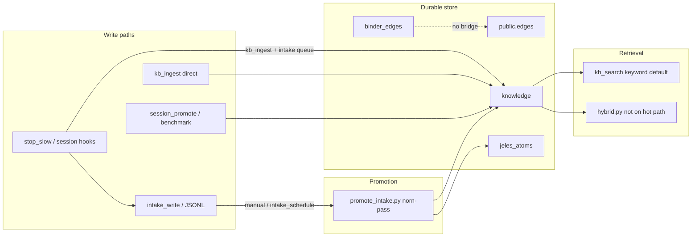

# Fleet Memory Audit

Date: 2026-06-07  
Agent: hanuman  
Mode: read-only audit (no promotion, ingestion, edge creation, or code changes)

## Executive Summary

Willow's Postgres KB is **technically healthy** (9,709 atoms, 100% embedding coverage, valid FRANK ledger) but **operationally thin** for fleet work: canonical decisions sit unpromoted in intake, benchmark/revelation noise dominates semantic retrieval, binder edges never reach durable `public.edges`, and graph neighbors are not used in search. Autonomous upkeep (norn-pass intake promotion, dream/sleep, hooks, workflows) is largely **manual or session-scoped** — memory maintenance follows whichever IDE agent last ran Fylgja hooks, not fleet-wide schedules.

The system is **partially wired**: intake-first contract exists on paper, rich atoms can be written, Discord responder uses KB search, Kart executes shell work. The gaps are **bridge and schedule** problems more than missing tables.

---

## Live Inventory (2026-06-07)

### Fleet posture

| Signal | Value |
|--------|-------|
| Postgres knowledge atoms | 9,709 |
| Jeles atoms | 93 |
| Postgres `edges` (valid) | 20 |
| Binder edges (total) | 296 (292 active, 4 proposed) |
| Active binder **not** in `public.edges` | **292** |
| Orphan postgres edges | 0 |
| Edges created (7d) | 0 |
| Embedding coverage (title+summary ≥20 chars) | 100% (9,703/9,703) |
| FRANK ledger | valid (74 entries) |
| Kart pending | 0 |
| Hook registry (active) | 0 |
| Workflows defined | 0 |
| Dream overdue | 337.5h, 311 sessions since last dream |
| Metabolic last briefing | 2026-06-03 |
| Hook executions (7d) | none logged |

### Intake backlog (filesystem `~/.willow/intake/`)

| Agent | Total | Pending | Canonical-tier pending | Thin pending (<80 chars) |
|-------|------:|--------:|----------------------:|-------------------------:|
| hanuman | 176 | 138 | 40 | 68 |
| enterprise | 80 | 80 | 0 | 80 |
| willow | 16 | 10 | 5 | 5 |

**228 pending records** fleet-wide; **45 canonical-tier** records waiting on norn-pass. Enterprise backlog is 100% thin content.

MCP `intake_list` (7-day window) under-reports vs filesystem — use full JSONL scan for fleet ops.

### KB composition

| Dimension | Top values |
|-----------|------------|
| Source type | `benchmark` 8,697 (89.6%), `session_promote` 295, `mcp` 153, `revelation` 77, `hook_stop` 59 |
| Tier | `frontier` 8,991, NULL 401, `canonical` 90, `observed` 157 |
| norn_pass promoted (ever) | 8 atoms |
| Duplicate titles | e.g. 81× `mycorrhizal — community node — willow/bench/locomo/conv-49` |

### SOIL

SOIL collections are overwhelmingly empty (0 records in agent atom namespaces). Working memory for agents lives in Postgres + intake JSONL, not SOIL graph stacks (`hanuman/stack/current` count 0).

### Fleet agents (26 registered)

Only **hanuman**, **willow**, and **enterprise** have intake directories with pending work. **loki**, **heimdallr**, **skirnir** show 0 intake backlog in this audit window — upkeep parity is tied to active IDE surfaces, not registry membership.

---

## Pipeline Trace

### Atom creation paths

| Path | Code | Behavior | Gap |
|------|------|----------|-----|
| Intake-first (contract) | `core/intake.py`, `intake_write` MCP | Annotated JSONL per agent | **228 pending**; promotion not scheduled fleet-wide |
| Norn-pass | `scripts/promote_intake.py` | `infer_7b classify` or heuristic routing | Per-agent CLI; MCP `intake_promote` lacks script's evidence-based auto-ratify; only **8** `norn_pass` atoms in KB |
| Direct KB | `kb_ingest` MCP | Gates REDUNDANT/CONTRADICTION; `quality_gate` opt-in | Bypasses intake contract; `quality_gate` rarely used |
| Stop hook | `willow/fylgja/events/stop_slow.py` | 3b session summary → `kb_ingest`; open-projects → intake | Thin `hook_stop` atoms (59); intake leg never promoted |
| Session extract | Nest/session promotion | One-liner summaries, NULL tier | 295 atoms; pollutes search |
| Benchmark / metabolic | `core/metabolic.py` community/revelation passes | 8,697+ benchmark atoms | Drowns fleet-topic retrieval |
| Binder | `mem_binder_edge` | Proposed/active edges in `binder_edges` | **292 active** never copied to `public.edges` |

### Naming trap: metabolic vs norn-pass

- **Contract/docs:** "norn-pass" = `promote_intake.py` (intake → KB tiers).
- **Code:** `core/metabolic.py::norn_pass()` runs compost, community detection, revelation, demote_stale — **does not call `promote_intake.py`**.
- **CLI:** `willow metabolic` triggers metabolic norn_pass, not intake promotion.

Operators conflating the two explains why intake canonical records age in place while metabolic runs produce revelation/benchmark noise.

### Edge creation paths

| Store | Count | Used in retrieval? |
|-------|------:|-------------------|
| `public.edges` | 20 | **No** — `kb_search` / `knowledge_search_semantic` do not traverse neighbors |
| `binder_edges` (active) | 292 | **No** — no promotion job to Postgres |
| SOIL graph edges | ~0 in agent stacks | Not on hot path |
| `willow/hooks/edge_linking.py` | On PostToolUse | Proposes binder edges; no retrieval wiring |

### Retrieval path

- `kb_search` defaults `semantic=False` (`sap/sap_mcp.py:909`).
- `kb_query` is an alias forcing keyword mode.
- Semantic path: ANN + ILIKE RRF in `pg_bridge.knowledge_search_semantic`; **no tier filter** on semantic branch.
- `willow/ranking/hybrid.py` (BM25 + pgvector RRF + temporal) exists but is **not** invoked from `kb_search`.
- Embeddings index **title + summary only** (`hybrid.py` docstring; `embedder` same).
- Every `kb_search` promotes visit_count on top 3 knowledge hits (`sap_mcp.py:949-953`) — amplifies whatever ranks first, including noise.

### Autonomy matrix

| Job | Intended | Live status |
|-----|----------|-------------|
| Intake promotion (norn-pass) | Fleet daemon | **Manual** — `intake_promote` / `intake_schedule` on demand; no cron in metabolic |
| Metabolic / community / revelation | Scheduled | Last briefing 2026-06-03; produces benchmark/revelation atoms |
| Dream / tension | Periodic synthesis | **337.5h overdue**, 311 sessions |
| Sleep / NREM consolidation | `sleep_consolidation.py` | Disabled by default (`kb_intelligence_run enabled=False`) |
| Shutdown extraction | `shutdown.py` | Session-scoped Fylgja hook |
| Hook registry | Fleet hooks | **0 active**; edge_linking is file-based PostToolUse |
| Workflows | Multi-phase automation | **0 defined** |
| Kart worker | Task queue | Operational; 0 pending; stale-running class still documented (Kart deep audit) |

---

## Semantic vs Keyword Retrieval (Gold Set)

Queries from current fleet work. **Hit@1** = expected atom in first knowledge result; **Hit@5** = in top 5 knowledge results.

| Query | Expected atom(s) | Keyword Hit@1 | Semantic Hit@1 | Notes |
|-------|------------------|:-------------:|:--------------:|-------|
| open projects Willow fleet | `FF2E4E49` | ✓ | ✓ | Best-case; semantic adds 4× revelation noise in top 5 |
| BKT boot shutdown wiring | `7F7DD4E9` | ✓ | ✓ | Fixed since prior sample — both modes work when atom exists |
| intake promotion norn-pass | `1BFEE7D2` | ✗ (0) | ✓ (rank 3) | Keyword too strict on hyphenated phrase |
| Kart task queue stale running | Kart deep audit atom | ✗ | ✗ | No canonical Kart audit atom; session extracts only |
| Discord Grove responder KB grounding | `C4283662` / stack atoms | ✗ | ✗ | Semantic returns old session "responder not built" before tier-routing atom |
| edge linking pg_edge binder | architecture atom | ✗ | partial | Session extracts about edges; no `public.edges` wiring atom |
| HNS Human Notification System | HNS design in `FF2E4E49` | partial (`FF2E4E49` mentions HNS) | partial | Semantic rank 2 is open-projects; Jeles noise in tail |

**Pattern:** Semantic helps on architectural vocabulary (intake design, BKT) but **Jeles_atoms always merge into top results**, and **benchmark/revelation frontier atoms** crowd canonical fleet facts. Keyword fails on multi-token exact phrases and absent canonical atoms (Kart, edge linking).

---

## Severity-Ranked Findings

### Critical

1. **Intake promotion bottleneck** — 228 pending intake records (45 canonical-tier). Stop hook writes open-projects to intake; fleet never promotes. Contract says intake-first; ops reality is intake-backlog.
2. **Binder → Postgres edge bridge missing** — 292 active binder edges, 20 postgres edges, 292 active binder rows with no matching `public.edges` row.
3. **Edges not used in retrieval** — Graph is write-only for search. No one-hop neighbor expansion in `kb_search`.
4. **Benchmark/revelation noise** — 89.6% of atoms are `benchmark` source; semantic search returns revelation "fleet ↔ X" atoms for fleet queries.
5. **`kb_search` defaults keyword; boot contract expects semantic topic search** — Agents must opt into `semantic=true`; `kb_query` forbids semantic entirely.

### High

6. **Metabolic norn_pass ≠ intake norn-pass** — Naming collision; metabolic does not promote intake.
7. **Multi-agent upkeep gap** — Only hanuman/willow/enterprise intake dirs have volume; 23 registry agents have no equivalent hook/promotion coverage.
8. **Dream/sleep/tension dormant** — 337h overdue; intelligence passes disabled by default.
9. **Thin session/hook atoms** — 59 `hook_stop`, 295 `session_promote`; NULL tier, short summaries bypass richness goals.
10. **`quality_gate` unused** — Canonical/decision atoms can land without rubric enforcement.

### Medium

11. **Embedding surface too narrow** — tags, keywords, evidence in `content` JSONB invisible to ANN.
12. **Duplicate title clusters** — LoCoMo community nodes (81×) inflate frontier tier counts.
13. **401 NULL-tier atoms** — Lifecycle state unclear for retrieval filtering.
14. **Hook registry empty** — No DB-tracked fleet hooks; Fylgja file hooks only on surfaces that install them.
15. **SOIL stacks empty** — Session working graph not populated for agents.

### Low / Informational

16. **Some rich canonical atoms exist** — `FF2E4E49` open projects, `7F7DD4E9` BKT wiring, `1BFEE7D2` intake design.
17. **Discord responder** — KB-grounded path shipped (PR #226); tier routing atom `C4283662` exists but ranks poorly.
18. **Kart operational** — Queue healthy; see `KART_DEEP_AUDIT_2026-06-04.md` for stale-running state-machine debt.

---

## Working / Partial / Not Wired

| Capability | Status |
|------------|--------|
| Postgres KB + embeddings | **Working** |
| FRANK ledger | **Working** |
| Intake write path | **Working** |
| Intake promotion fleet-wide | **Not wired** (manual only) |
| Rich canonical atoms | **Partial** (few exemplars; backlog unprocessed) |
| Binder edge capture | **Partial** (292 active; no Postgres bridge) |
| Postgres edges | **Partial** (20 rows; orphan-free; unused in search) |
| Semantic kb_search default | **Not wired** |
| Hybrid RRF retrieval | **Not wired** (code exists) |
| Graph-expanded retrieval | **Not wired** |
| Metabolic intake promotion | **Not wired** (name collision only) |
| Dream / sleep / tension schedule | **Not wired** |
| Hook registry / fleet parity | **Not wired** |
| Workflows | **Not wired** |
| SOIL agent stacks | **Not wired** (empty) |
| Quality gate on ingest | **Partial** (opt-in, rarely called) |

---

## Remediation Order (PR-Sized)

### Data repair (safe to batch; no schema required)

| PR | Action |
|----|--------|
| D1 | Fleet intake promotion **dry-run report** Kart task: per-agent pending, canonical count, thin count, oldest record age |
| D2 | Promote **45 canonical-tier** intake records (hanuman + willow) after human review of dry-run |
| D3 | Archive or supersede **LoCoMo benchmark duplicate titles** (81× conv-49 cluster) — tier=`superseded`, keep one canonical |
| D4 | Tag/filter revelation+benchmark atoms from default search (project filter or `source_type NOT IN` view) |
| D5 | Backfill **NULL tier** on session_promote/hook_stop atoms → `frontier` or supersede if duplicate |

### Code wiring (behavior change)

| PR | Action |
|----|--------|
| C1 | **Schedule fleet norn-pass** — Kart cron or metabolic hook calling `promote_intake.py --no-llm` for all intake dirs; rename metabolic `norn_pass` → `metabolic_pass` to kill collision |
| C2 | **Binder → Postgres bridge** — on `mem_binder_edge` approve/active, upsert `public.edges`; batch backfill 292 rows |
| C3 | **One-hop retrieval** — after `kb_search` top-k, fetch `edges` neighbors, merge with RRF, cap budget |
| C4 | **Default semantic + hybrid** — `kb_search` semantic default true; wire `hybrid.py` into `knowledge_search_semantic`; add `tier` filter to semantic path |
| C5 | **Rich embedding** — embed `title + summary + tags + keywords + evidence snippet` (cap tokens) |
| C6 | **Canonical quality gate** — `kb_ingest` and norn-pass routes for `tier=canonical` require `quality_gate=true` or rubric min length |
| C7 | **Dream/sleep surfacing** — `dream_check` in boot; Kart scheduled `dream_run` when `should_dream`; document sleep pass opt-in |
| C8 | **Hook registry seed** — register edge_linking, stop_slow, shutdown; log to `hook_executions` |
| C9 | **stop_slow split** — session friction → intake only; reserve `kb_ingest` for rubric-passing summaries |
| C10 | **Fleet agent intake dirs** — scaffold `~/.willow/intake/<agent>/` for named fleet agents; document promotion parity in `docs/CONTRACT.md` |

**Suggested sequence:** D1 → C1 → D2 → C4 → C2 → C3 → D3/D4 → C5–C10.

---

## Evidence References

- Live SQL: `.kart-scripts/fleet-memory-audit-readonly.py`, `intake-backlog-count.py` (Kart, 2026-06-07)
- MCP: `fleet_status`, `kb_search` gold queries, `dream_check`, `hook_list`, `workflow_list`, `soil_stats`
- Code: `sap/sap_mcp.py` (`kb_search`), `core/pg_bridge.py`, `scripts/promote_intake.py`, `core/metabolic.py`, `willow/ranking/hybrid.py`, `willow/fylgja/events/stop_slow.py`, `willow/hooks/edge_linking.py`
- Prior audits: `docs/audits/KART_DEEP_AUDIT_2026-06-04.md`, `docs/audits/MCP_POSTGRES_AGENT_RELATIONSHIP_AUDIT_2026-06-04.md`

---

## Data Repair Executed (2026-06-07)

Script: `scripts/fleet_data_repair.py` (Kart batch run).

| Phase | Result |
|-------|--------|
| D2 promote-canonical | **45** canonical intake records cleared (hanuman + willow); **12** new `source_type=intake` KB atoms with tier preserved; **4** willow open-projects dupes skipped in-batch; intake pending **228 → 183** |
| D3 dedupe-locomo | **80** atoms superseded; kept `myco_monetary_communit` |
| D4 tag-noise | **8,884** atoms tagged `content.search_noise=true` (benchmark, revelation, mycorrhizal, community_detection) |
| D5 backfill-tier | **295** `session_promote` atoms set to `tier=frontier` |

Post-repair verification:

- `intake_pending_canonical`: **0**
- `kb_superseded_tier`: **82**
- `kb_search_noise_tagged`: **8,855**
- `kb_null_tier_remaining`: **106** (seed, handoff-migration, session, etc. — not in D5 scope)

**Note:** Kart bwrap could not reach Ollama during ingest; **12** intake atoms briefly lacked embeddings — backfilled immediately via `allow_net` Kart task (12/12).

**Remaining data work:** 183 non-canonical intake pending (enterprise thin backlog, hanuman frontier/observed); D4 tags are preparatory until `kb_search` filters `search_noise` (code phase C4).

### Live fleet promote (2026-06-07, post-D2)

- `promote_intake.py --fleet --no-llm --all-files`: **183/183 promoted**, intake backlog **0** (30-day window)
- Dedup pass: **82** benchmark/open-project mirrors superseded + `search_noise` tagged
- Gold benchmark: keyword Hit@1 **3/7**, semantic Hit@5 **5/7**, noise in top-5 **0**

---

## Code Remediation Status (2026-06-07)

| ID | Status | Notes |
|----|--------|-------|
| C1 | Done | Fleet norn-pass + `intake_schedule_fleet` + metabolic promote |
| C2 | Done | Binder → `public.edges` sync + backfill 292/292 |
| C3 | Done | `knowledge_expand_neighbors` + `kb_search(expand_neighbors=True)` |
| C4 | Done | Semantic default, hybrid BM25+pgvector hot path, noise/superseded filters |
| C5 | Done | Rich embedding text in `knowledge_put` |
| C6 | Done | Canonical quality gate at ingest + norn-pass |
| C7 | Done | `dream_check` boot step, `dream_schedule`, norn dream queue |
| C8 | Done | Hook registry seed on SessionStart |
| C9 | Done | Stop hook: friction → intake; clean → KB if session quality passes |
| C10 | Done | `ensure_fleet_intake_dirs` + `scaffold_fleet_intake_dirs.py` + CONTRACT.md |

**Scripts:** `scripts/fleet_data_repair.py`, `scripts/seed_fleet_memory_atoms.py` (canonical Kart + edge-linking atoms for gold-set gaps).

**Optional follow-up:** ~106 NULL-tier atoms remain outside D5 scope.

---

*Audit complete. Data repair phase 1 applied 2026-06-07. Code remediation C1–C10 on branch `feat/memory-c5-c6`.*
