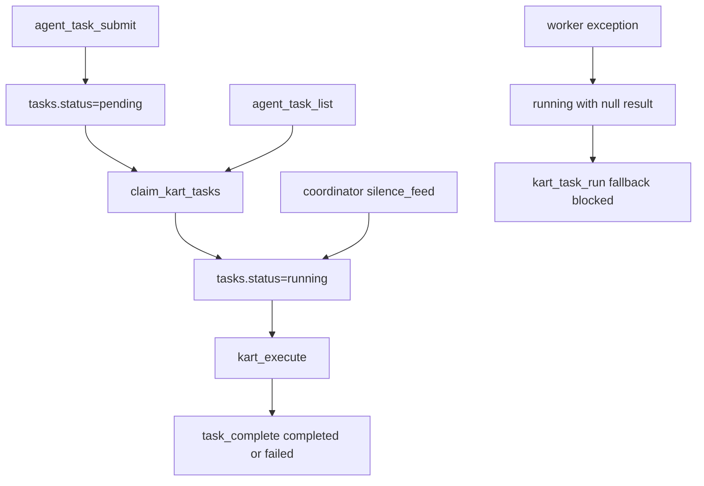

# Kart Deep Audit

Date: 2026-06-04
Agent: hanuman (persona overlay: skirnir)
Mode: diagnostic audit

## Executive Summary

Kart is not one broken component. It is a queue whose state machine is weakly guarded. The live system can submit and complete ordinary commands, but several paths can move rows into `running` without a guaranteed executor or recovery path. Once stale `running` rows exist, `kart_task_run` fallback intentionally refuses to claim pending work. That makes Kart look intermittently alive while recovery is blocked by old state.

Most important findings:

- `agent_task_list` is marked read-only but claims rows (`pending` -> `running`).
- `willow/coordinator.py` can set tasks to `running` directly without executing them.
- There are 9 stale `running` rows with `result IS NULL`, aged from ~2.5 hours to 10 days.
- Status vocabulary is split across docs, dashboards, and code: `in_progress`, `blocked`, `queued`, `running`, `complete`, `completed`, `failed`.
- Result payloads truncate stdout/stderr heavily and omit enough metadata that failed tasks are hard to diagnose later.
- Service/runtime health is not represented in the task table; a daemon crash leaves claimed tasks indefinitely `running`.

## Intended Contract

Docs currently describe:

- Submit shell work through `agent_task_submit`.
- Kart worker or `kart_task_run` consumes it.
- State is `pending -> in_progress -> completed` or `blocked`.

Code currently implements:

- `agent_task_submit` inserts `public.tasks(status='pending', agent='kart')`.
- `claim_kart_tasks` atomically changes `pending -> running`.
- `task_complete` changes `running -> completed|failed`.
- `tasks_by_status` is the read-only query path.
- `kart_task_run` waits for daemon completion, then only falls back if there are pending rows and no running rows.

Observed live states:

| status | count |
|--------|------:|
| complete | 216 |
| completed | 933 |
| failed | 446 |
| running | 9 |

All rows are `agent='kart'`.

## Live Queue Findings

### F1 - Stale `running` rows block fallback

Live query found 9 `running` rows, all with `result IS NULL`.

Oldest examples:

| id | submitted_by | age | task |
|----|--------------|-----|------|
| `6903482F` | `sap_startup` | 10 days | `willow_embed_backfill.py` |
| `EC9DD4E9` | `hanuman` | 9 days | `promote_intake.py --limit 3 --dry-run` |
| `76CD662C` | `ganesha` | 7 days | git branch probe |
| `0A7126EF` | `hanuman` | 2 days | `cat ~/.willow/secrets/credentials.json` |
| `AF8DC4CA` | `hanuman` | 2.5 hours | OpenClaw rebase watcher |

Why this matters: `kart_task_run` checks for any `running` row before fallback. A single orphaned row suppresses fallback for unrelated pending work.

Severity: Critical

### F2 - Read API mutates queue state

`sap/sap_mcp.py` declares `agent_task_list` with `readOnlyHint=True`, but calls `pg.pending_tasks`.

`core/pg_bridge.py` defines:

- `claim_kart_tasks`: updates `pending` rows to `running`.
- `pending_tasks`: alias for `claim_kart_tasks`.

So the tool named "list pending tasks" is actually "claim pending tasks".

Recent MCP receipts show this is not theoretical:

| app_id | tool | count in 7d |
|--------|------|------------:|
| `willow` | `agent_task_list` | 135 |
| `hanuman` | `agent_task_list` | 102 |

Each call could have claimed rows without executing them.

Severity: Critical

### F3 - Coordinator writes `running` directly

`willow/coordinator.py` has a silence-feed path:

```text
UPDATE public.tasks SET status = 'running' WHERE id = %s AND status = 'pending'
```

The comment says "Mark the task as running so Kart picks it up", but Kart only claims `pending` rows. A row set to `running` this way will not be picked up by Kart worker or fallback execution.

Severity: Critical

### F4 - Worker exception path leaves claimed rows orphaned

`core/kart_worker.py` claims a task, opens a run ledger row, executes, and then calls `task_complete`. If an exception escapes outside `execute_task_row` after claim and before `task_complete`, the outer `except` logs and resets the PG connection but does not fail or release the task.

There is no reaper for rows where:

- `status='running'`
- `result IS NULL`
- `updated_at` older than timeout

Severity: High

### F5 - Status vocabulary drift hides state

Observed and documented statuses disagree:

| Surface | Statuses |
|---------|----------|
| `wiki/kart-and-tasks.md` | `pending`, `in_progress`, `completed`, `blocked` |
| `core/pg_bridge.py` | `pending`, `running`, `completed`, `failed`, legacy `complete` |
| `grove/apps/vitals.py` | `running`, `queued` |
| live DB | `complete`, `completed`, `failed`, `running` |

Dashboard vitals count `queued`, but Kart uses `pending`. That means the UI can under-report waiting work.

Severity: High

### F6 - Failure observability is too thin

Recent failed tasks show many `returncode=1/128/127` with no `error`. `core/kart_sandbox.py` truncates:

- stdout to last 2000 chars
- stderr to last 500 chars

That is useful for compact status, but bad as the only durable record. Failures often lack:

- full command hash or script path metadata
- executor context (`daemon`, `poll`, `fallback`)
- bwrap argv summary / allow_net
- environment fingerprint (`WILLOW_AGENT_NAME`, `WILLOW_ROOT`, `WILLOW_PG_HOST`)
- full stdout/stderr artifact path

Severity: High

### F7 - Sandbox/env problems have recurring signatures

Failure buckets include:

- `WILLOW_AGENT_NAME is not set`
- Postgres socket `/var/run/postgresql/.s.PGSQL.5432` missing
- `bwrap: execvp bash: No such file or directory`
- `node` / `bun` command not found
- shell quoting errors from long inline commands

Several of these have been patched in code (`kart_env`, symlink and socket handling, `.kart-scripts`), but old failures remain in the queue and there is no automated regression dashboard grouping failures by signature.

Severity: Medium

### F8 - Tests encode old semantics

Tests in `tests/test_pg_bridge_phase1.py` and `tests/test_enterprise.py` use `pending_tasks()` as the claiming primitive. That was probably fine internally, but it made the name safe to expose through an MCP read tool even though it mutates.

Tests cover successful drain but do not cover:

- stale `running` reaping
- daemon crash after claim
- `agent_task_list` read-only behavior
- coordinator direct `running` update
- status normalization from `complete` to `completed`
- full bwrap execution in CI (tests set `WILLOW_KART_NO_BWRAP=1`)

Severity: Medium

## Root Cause Model



The invariant that should hold is: only an executor may move `pending -> running`, and any move to `running` must have a lease, owner, heartbeat, timeout, and terminal recovery path. Today that invariant is not enforced.

## Repair Sequence

### PR 1 - Split read from claim

- Rename or keep `claim_kart_tasks` as the only claiming primitive.
- Make `pending_tasks` genuinely read-only or deprecate it.
- Change `agent_task_list` to use `tasks_by_status(statuses=['pending'])`.
- Add tests proving `agent_task_list` does not mutate status.

Files:

- `core/pg_bridge.py`
- `sap/sap_mcp.py`
- `tests/test_pg_bridge_phase1.py`

### PR 2 - Add leases and stale-running recovery

- Add columns or result metadata for `claimed_at`, `claimed_by`, `lease_expires_at`, `execution_context`.
- Add `reap_stale_tasks(max_age)` to mark orphaned `running` rows `failed` with `error='orphaned_running_reaped'`.
- Call reaper before `kart_task_run` fallback and in daemon startup.
- Make `task_complete` log or return a structured error if row is not `running`.

Files:

- `core/pg_bridge.py`
- `core/kart_worker.py`
- `sap/sap_mcp.py`

### PR 3 - Remove direct `running` writes outside Kart

- Delete or rewrite `willow/coordinator.py` silence-feed direct update.
- If coordinator wants action, it should notify or submit, not claim.
- Add a code search test that fails on raw `UPDATE public.tasks SET status='running'` outside `core/pg_bridge.py`.

Files:

- `willow/coordinator.py`
- tests under `tests/`

### PR 4 - Normalize statuses

- Migrate legacy `complete` to `completed`.
- Update docs from `in_progress`/`blocked` to actual states or implement those states explicitly.
- Fix Grove vitals to count `pending`, not `queued`.

Files:

- `wiki/kart-and-tasks.md`
- `willow/fylgja/skills/kart.md`
- `grove/apps/vitals.py`
- `core/pg_bridge.py`

### PR 5 - Improve durable failure artifacts

- Store compact result in `tasks.result` plus full logs under `.kart-logs/<task_id>/`.
- Include executor metadata: `context`, `allow_net`, `sandbox`, `cwd`, `script_path`, `env_fingerprint`.
- Include stderr/stdout byte counts and truncation flags.

Files:

- `core/kart_sandbox.py`
- `core/kart_execute.py`
- `sap/sap_mcp.py`

### PR 6 - Worker health and observability

- Add a `kart_status` MCP tool or extend `fleet_status` with:
  - pending/running/stale counts
  - worker heartbeat age
  - last completed task
  - last failure signature
- Add worker heartbeat table/row.

Files:

- `core/kart_worker.py`
- `sap/sap_mcp.py`
- `grove/apps/vitals.py`

### PR 7 - Tests for failure modes

Add tests for:

- read-only listing does not claim
- stale running row is reaped
- daemon exception fails or releases claimed row
- coordinator cannot mark running directly
- status vocabulary uses `completed`
- bwrap smoke path where available

## Immediate Manual Triage (Do Not Automate Without Approval)

The 9 stale `running` rows should be reviewed before resetting. At least one (`AF8DC4CA`) is a named watcher from current upstream work. Others are days old and likely safe to mark failed, but this audit did not mutate them.

Suggested SQL after approval:

```sql
UPDATE public.tasks
SET status='failed',
    result=jsonb_build_object(
      'error', 'manual_reap_stale_running',
      'previous_status', 'running',
      'reaped_at', now()::text
    ),
    updated_at=now()
WHERE status='running'
  AND result IS NULL
  AND updated_at < now() - interval '2 hours';
```

Use a narrower allowlist if `AF8DC4CA` should remain as an intentional watcher.

## Verification Checklist After Repairs

```sql
SELECT status, COUNT(*) FROM public.tasks GROUP BY status ORDER BY status;

SELECT COUNT(*) AS stale_running
FROM public.tasks
WHERE status='running'
  AND result IS NULL
  AND updated_at < now() - interval '1 hour';

SELECT app_id, tool, ok, COUNT(*)
FROM willow.mcp_receipts
WHERE tool IN ('agent_task_submit','agent_task_list','agent_task_status','kart_task_run')
  AND ts > now() - interval '1 day'
GROUP BY app_id, tool, ok
ORDER BY COUNT(*) DESC;
```

Expected after repair:

- no legacy `complete`
- no stale `running`
- `agent_task_list` calls do not change task statuses
- `kart_task_run` can fallback when daemon is absent
- Grove vitals report pending and stale counts accurately

## Witness Note

Kart is carrying work across the boundary, but the gate does not stamp the crossing strongly enough. Rows can enter `running` without a living runner. They can remain there without a lease. Watchers and dead tasks look identical. The fix is not a bigger worker; it is a stricter state machine.

*DS=42*
