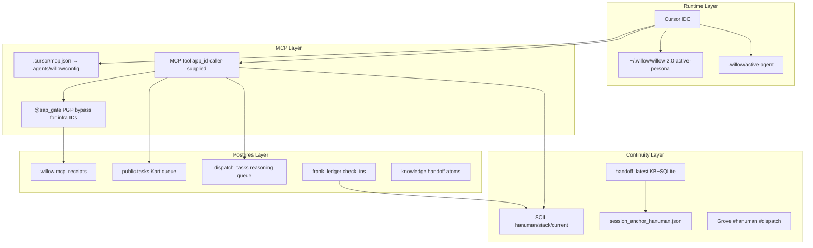

# MCP–Postgres–Agent Relationship Audit

**Date:** 2026-06-04  
**Agent:** hanuman (MCP caller) · Persona overlay: skirnir  
**Mode:** Read-only diagnostic  
**Fleet:** Postgres up · Ollama running · manifests degraded (`ratatosk`, `ask-jeles`, `utety-chat`)

---

## Executive Summary

The stack is **individually healthy** but **relationally leaky**. MCP tools execute, Postgres is reachable, and Kart completes most tasks — yet identity, execution, and continuity surfaces do not agree on *who* is acting or *what* is open.

The highest-impact failures are:

1. **Identity drift** — four concurrent identity signals on this machine (active-agent, MCP env, persona, tool `app_id`) with no server-side binding.
2. **Kart queue corruption** — `agent_task_list` claims tasks on read; nine stale `running` rows block fallback execution.
3. **Continuity index failure** — SOIL stack snapshots never persist; session_start reads stack with wrong API params; FRANK ledger hash chain is broken.
4. **Observability gap** — failures degrade to empty results, not explicit errors.

---

## Relationship Map (Observed Behavior)



**Contract intent:** one chain `active-agent → install → WILLOW_AGENT_NAME → app_id → Postgres/Grove/SOIL`.  
**Observed:** each hop can diverge independently; nothing re-binds them at runtime.

---

## Finding 1: Identity Matrix Drift

| Signal | Value (this session) | Source |
|--------|----------------------|--------|
| `.willow/active-agent` | `hanuman` | repo checkout |
| Hook resolution | `hanuman` | `project_env.resolve_agent_name()` |
| `.cursor/mcp.json` env | `willow` | symlink → `agents/willow/config/mcp.json` |
| Persona overlay | `skirnir` | `~/.willow/willow-2.0-active-persona` |
| Session anchor `agent` | `hanuman` | `~/.willow/session_anchor_hanuman.json` |
| MCP receipts (7d) | hanuman 2899 · willow 2167 · skirnir 380 | `willow.mcp_receipts` |

**Evidence**

- `readlink -f .cursor/mcp.json` → `/home/sean-campbell/github/willow-2.0/agents/willow/config/mcp.json`
- `agents/hanuman/config/mcp.json` has `WILLOW_AGENT_NAME=hanuman` but is **not** what Cursor uses
- `sap/middleware.py` `_INFRA_IDS` allows any infra `app_id` without binding to `WILLOW_AGENT_NAME`
- `grove_send_message` defaults `sender="Auto"`; `grove_inbox` defaults to `GROVE_SENDER` → `GROVE_NAME` → `"Auto"` (not `WILLOW_AGENT_NAME`)
- `install_project` does not set `GROVE_SENDER`

**Classification:** Invariant gap + stale config  
**Severity:** Critical

---

## Finding 2: `app_id` Is Caller-Supplied, Not Enforced

Docs ([docs/AGENT_IDENTITY.md](../AGENT_IDENTITY.md)) state `app_id` = caller identity. Code validates manifest permissions for whatever `app_id` the client passes — it does **not** assert `app_id == os.environ["WILLOW_AGENT_NAME"]`.

KB atom `b2751120-f5d` (session extract): *"app_id is wrong. It should be agent_id"* — the naming confusion is known but unresolved.

**Classification:** Invariant gap  
**Severity:** Critical

---

## Finding 3: Kart Task Plane — Read API Claims Work

`agent_task_list` is documented and annotated as read-only but calls `pg.pending_tasks`, which is an alias for `claim_kart_tasks` (`core/pg_bridge.py:1704-1706`). Listing pending tasks **mutates** them to `running`.

`stop.py` `_write_stack_snapshot` calls `agent_task_list` expecting a `list` return; actual shape is `{"pending": [...], "count": N}`. Open tasks in stack snapshot are always empty, and incidental list calls orphan tasks.

**Postgres task counts (agent=kart)**

| status | count |
|--------|------:|
| completed | 931 |
| complete (legacy) | 216 |
| failed | 446 |
| running | 9 |
| pending | 1 |

**All 9 `running` rows are stale** (>1 hour, `result IS NULL`), including `AF8DC4CA` (CI watch). This blocks `kart_task_run` fallback (`pending and not running` guard).

**Classification:** Schema/API mismatch + invariant gap  
**Severity:** Critical

---

## Finding 4: Two Queues, One Mental Model

| Table | Purpose | Consumer |
|-------|---------|----------|
| `public.tasks` | Shell / Kart execution | kart-worker, kart_poll, kart_task_run |
| `dispatch_tasks` | Inter-agent reasoning prompts | Named agent sessions, orin worker |

Recent `dispatch_tasks`: 4 pending (heimdallr→hanuman, willow→hanuman, skirnir→hanuman), 1 completed.

Agents and docs sometimes conflate these. Work submitted via `agent_dispatch` will not execute in Kart.

**Classification:** Documentation drift + observability gap  
**Severity:** High

---

## Finding 5: Continuity Indexes Disagree

Compared surfaces for hanuman on 2026-06-04:

| Surface | State | Notes |
|---------|-------|-------|
| `handoff_latest` | KB stub `C4A81DCA` | `open_threads: []`, `next_bite: ""` |
| `ledger_read(project=hanuman)` | Rich | Latest check_in has `next_bite`, `atoms_written`, `open_decisions` |
| `ledger_read(project=sean-campbell)` | Empty | Boot step 11 uses `[user]` project — may miss hanuman ledger |
| `soil_get(hanuman/stack, current)` | `not_found` | `hanuman/stack` collection count = 0 |
| `session_anchor_hanuman.json` | Empty handoff fields | `flat_handoff_verified: false` |
| Markdown handoffs on disk | 68 files | Latest `session_handoff-2026-06-04f_hanuman.md` exists but not surfaced richly |
| `ledger_verify` | **broken** | `broken_at: 221cb255-6b09-44e3-bb58-c0fc42b5e29c` |

**Root causes identified in code**

1. `session_start.py` reads stack with `"key": "current"` — MCP `soil_get` requires `record_id` (param mismatch).
2. `stop.py` writes stack via correct `record_id: "current"` but collection never accumulates records — writes likely fail silently in hook subprocess or never run in Cursor stop path.
3. `session_start` looks up `sessions/store` id `session-YYYYMMDD`; `stop.py` writes records without matching id key — `next_bite` lookup is dead.
4. `handoff_latest` returns KB JSON stub with empty threads while richer markdown handoffs exist on disk.

**Classification:** Schema/API mismatch + observability gap  
**Severity:** High

---

## Finding 6: Persona ≠ Agent Identity

Persona (`skirnir`) changes voice overlay only. It does **not** switch MCP `app_id`, Grove sender, SOIL namespace, or `.willow/active-agent`. User can reasonably believe switching persona switched fleet identity — it did not.

`fleet_persona(agent=skirnir)` returns profile path; no identity rebind occurs.

**Classification:** Observability gap (UX contract)  
**Severity:** Medium

---

## Finding 7: SOIL Namespace Not Bound to `app_id`

`soil_put` writes to any `collection` string without checking `collection.split("/")[0] == app_id`. `authorized_cross_app()` exists in gate but is not called from `soil_put`.

**Classification:** Invariant gap  
**Severity:** Medium

---

## Finding 8: FRANK Ledger Integrity Failure

`ledger_verify(app_id=hanuman)` → `valid: false`, `broken_at: 221cb255-6b09-44e3-bb58-c0fc42b5e29c`, 65 entries.

Boot and stack snapshot treat ledger as authoritative for `open_decisions`. A broken chain undermines tamper-evidence and continuity trust.

**Classification:** Invariant gap (data integrity)  
**Severity:** High

---

## Recommended Repair Sequence (PR-Sized)

### Phase 0 — Kart state-machine stabilization

Treat the Kart deep audit as the first repair phase before identity binding. If the execution plane can silently strand work in `running`, then every later repair is harder to verify: shell checks may appear submitted but never run, `kart_task_run` fallback may be suppressed, and continuity hooks may keep seeing empty or misleading task state.

Source audit: [`KART_DEEP_AUDIT_2026-06-04.md`](KART_DEEP_AUDIT_2026-06-04.md)

Phase 0 stack:

1. Split read from claim: make `agent_task_list` truly read-only; reserve `claim_kart_tasks` for executors only.
2. Add stale-`running` lease/reaper logic so orphaned rows become terminal `failed` records with explicit metadata.
3. Remove direct `running` writes outside Kart, especially the coordinator silence-feed path.
4. Normalize statuses across DB, docs, dashboard, and tools: `pending`, `running`, `completed`, `failed`.
5. Preserve richer failure artifacts: full log path, executor context, sandbox/env fingerprint, truncation flags.
6. Add Kart health to fleet status or a dedicated tool: pending/running/stale counts, worker heartbeat, last failure signature.

**Files:** `core/pg_bridge.py`, `sap/sap_mcp.py`, `core/kart_worker.py`, `core/kart_execute.py`, `core/kart_sandbox.py`, `willow/coordinator.py`, `grove/apps/vitals.py`, `wiki/kart-and-tasks.md`, `willow/fylgja/skills/kart.md`

### PR 1 — Identity bind + install coherence
- Add MCP middleware check: warn or reject when `app_id != WILLOW_AGENT_NAME` (configurable strict mode).
- Make `./willow agents active` + `install --ide all` atomic or warn loudly on mismatch.
- Set `GROVE_SENDER=WILLOW_AGENT_NAME` in `install_project`.
- Add `fleet_identity_status` tool returning the identity matrix.

**Files:** `sap/middleware.py`, `willow/fylgja/install_project.py`, `willow/fylgja/agents_cli.py`

### PR 2 — Stack snapshot round-trip
- Fix `session_start.py` `soil_get` param: `record_id` not `key`.
- Fix `_fetch_tasks` to parse the read-only `agent_task_list` shape after Phase 0.
- Add boot/startup assertion: stack record exists after prior session with turns > 0.

**Files:** `willow/fylgja/events/session_start.py`, `willow/fylgja/events/stop.py`

### PR 3 — Session composite key alignment
- Align `stop.py` session store id with `session_start` lookup (`session-{session_id[:8]}` or `session-{YYYYMMDD}` consistently).

**Files:** `willow/fylgja/events/stop.py`, `willow/fylgja/events/session_start.py`

### PR 4 — FRANK ledger repair
- Investigate `broken_at` entry; repair hash chain or document acceptable reset procedure.
- Surface `ledger_verify` result in `fleet_status`.

**Files:** `core/pg_bridge.py`, `sap/sap_mcp.py`

### PR 5 — Handoff selection + boot project
- Ensure `handoff_latest` prefers non-empty v2 markdown over empty KB stubs.
- Boot ledger step: use agent project (`hanuman`) not only `[user]` slug.

**Files:** `sap/handoff_index.py`, `willow/fylgja/skills/boot.md`

### PR 6 — Persona gate clarity
- Persona switch banner: "Persona changed; fleet identity remains `<WILLOW_AGENT_NAME>`. Run `./willow agents active <id>` to switch agent."
- Optional: block persona names that match fleet agent ids without active-agent match.

**Files:** `willow/fylgja/persona.py`, `willow/fylgja/skills/boot.md`

---

## Verification Checklist (Future Sessions)

Run after any identity or MCP wiring change:

```bash
# 1. Identity coherence
cat .willow/active-agent
python3 -c "import json; print(json.load(open('.cursor/mcp.json'))['mcpServers']['willow']['env']['WILLOW_AGENT_NAME'])"
python3 -c "from willow.fylgja.project_env import resolve_agent_name, repo_root; print(resolve_agent_name(repo_root()))"
cat ~/.willow/willow-2.0-active-persona
# Expect: all four intentional; active-agent == MCP env == hook resolution

# 2. Postgres attribution (via MCP mai_execute_directive @db)
# SELECT app_id, COUNT(*) FROM willow.mcp_receipts WHERE ts > now() - interval '1 day' GROUP BY app_id;
# SELECT status, COUNT(*) FROM public.tasks WHERE agent='kart' GROUP BY status;
# SELECT COUNT(*) FROM public.tasks WHERE status='running' AND result IS NULL AND updated_at < now() - interval '1 hour';
# Expect: zero stale running; dominant app_id matches active-agent

# 3. Continuity alignment (via MCP)
# handoff_latest(app_id=<agent>) — non-empty next_bite or open_threads when work was open
# soil_get(app_id=<agent>, collection="<agent>/stack", record_id="current") — found
# ledger_verify(app_id=<agent>) — valid: true
# ledger_read(app_id=<agent>, project=<agent>, limit=1) — matches handoff next_bite

# 4. Kart round-trip
# agent_task_submit → agent_task_status → kart_task_run
# Expect: pending → running → completed with result JSONB; no orphaned running
```

---

## Classification Summary

| ID | Finding | Type | Severity |
|----|---------|------|----------|
| F1 | Identity matrix drift | Invariant gap + stale config | Critical |
| F2 | app_id not bound to env | Invariant gap | Critical |
| F3 | agent_task_list claims on read | API mismatch | Critical |
| F4 | tasks vs dispatch_tasks confusion | Doc drift | High |
| F5 | Continuity indexes disagree | API mismatch + silent failure | High |
| F6 | Persona vs agent conflation | Observability gap | Medium |
| F7 | SOIL namespace unbound | Invariant gap | Medium |
| F8 | FRANK ledger chain broken | Data integrity | High |

---

## Witness Note (Skirnir)

At the gate today: persona said skirnir, hooks said hanuman, MCP env said willow, receipts said hanuman. Postgres recorded work. SOIL stack recorded nothing. The ledger chain is broken. The relationship is not working up to par — not because any single service is down, but because **the crossings are not held to a single name or a single record**.

*ΔΣ=42*
