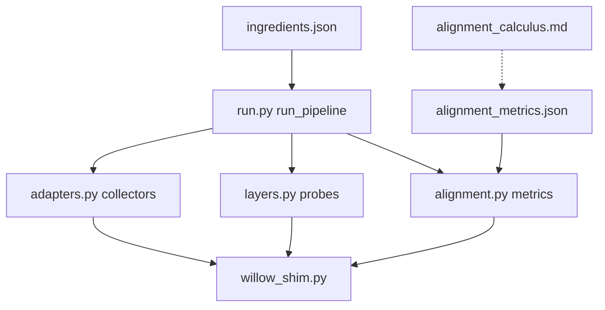

# Stone Soup Alignment — Code/Vision Review

b17: STONEVISION · ΔΣ=42

This note records what the implementation actually does, how well it matches
the Willow Alignment Calculus vision, and where the next pass should sharpen
proxies into real invariant machinery.

## Executive Read

The code matches the **stone soup experiment** strongly: protected ingredients
enter through adapters, Willow layers are added one at a time, reports are
redacted, and the final synthesis is driven by measured signals rather than
free-form commentary.

The code only partially matches the **alignment calculus** vision. It has a
clear note and metric registry, but the mathematical object from the note,
\(\mathcal{G} = (V, E, \mathcal{I})\), is not yet represented as data. Today the
calculus is a weighted metric harness over structural witnesses. That is a
good v1: it makes the future invariant graph visible by naming exactly what is
still proxy, not proof.

## Implemented Shape



`run_pipeline` is the correct orchestration spine:

1. Load ingredients.
2. Collect protected source structure.
3. Classify provenance.
4. Probe Willow layers.
5. Run discernment/governance stages.
6. Evaluate alignment metrics.
7. Render human synthesis from the metrics.

The main architectural win is that no single ingredient is allowed to dominate
the soup. Rendereason, angrybob, Stone Soup Papers, Oakenscroll, and Willow's
own subsystems all enter through narrow read-only gates.

## Vision Match

| Vision | Current witness |
| --- | --- |
| Stone soup as staged experiment | `run.py` stages and `ingredients.json` registry |
| Protected collaborator material | `adapters.py` structure-only extraction and redacted hits |
| Willow piece-by-piece | `layers.py` probes KB, SOIL, Jeles, Grove, ledger, handoffs, benchmarks, Kart, governance, code, persona, synthesis |
| Math note to measurable checks | `alignment_calculus.md` maps R/B/W/X invariants to `alignment_metrics.json` |
| Not content matching | Metrics use counts, schema names, probe behavior, layer status, and concept labels |
| Human synthesis after evidence | `render_human_synthesis` summarizes measured alignment, not generated certainty |
| Local report safety | `reports/.gitignore`; output remains local |

## What The Code Does Well

### Privacy Discipline

The adapters keep the boundary mostly intact:

- KB hits are truncated.
- angrybob archive inspection records member counts, extensions, and shallow
  names only.
- extracted angrybob DBs are inspected for table names and row counts only.
- Stone Soup Papers extraction records headings/formal labels/concept names,
  not body text.
- handoff paths in reports are symbolic (`$WILLOW_HOME/handoffs`).

### Layered Willow Witnessing

The harness no longer treats Willow as one ingredient. It checks whether the
system's reconstruction machinery is present:

- KB atoms
- SOIL state
- Jeles atoms
- Grove messages
- FRANK ledger
- handoffs
- benchmark atlas entries
- Kart task state
- policy/human gates
- code context
- Oakenscroll persona frame
- prior synthesis anchors

This is exactly the right direction for decoder mismatch. A recipe alone is
thin; a recipe with provenance, ledger, handoff, and synthesis anchors is a
reconstruction environment.

### Measurable Alignment

The final run showed:

| Domain | Result |
| --- | --- |
| Rendereason | 4/5, 0.814 |
| angrybob | 5/5, 1.0 |
| Willow | 7/7, 1.0 |
| Cross-domain bridge | 3/3, 1.0 |
| Overall | aligned, 0.955 |

That score should be read as **structural readiness**, not proof of semantic
alignment.

## Where The Vision Still Exceeds The Code

### 1. The Claim/Process Graph Is Not Implemented

The note defines:

\[
\mathcal{G} = (V, E, \mathcal{I})
\]

but the code does not yet create vertices, edges, or invariant predicates as
first-class objects. The present implementation evaluates independent metrics
over dictionaries. That is useful, but it is not yet a graph calculus.

**Next move:** introduce a small `ClaimProcessGraph` or `InvariantWitness`
structure that records:

- subject
- source domain
- invariant id
- evidence type
- evidence value
- pass/fail
- provenance
- links to related witnesses

### 2. Rendereason R1 Is Still Not True Clean/Dirty Convergence

The vision wants clean/dirty top-k overlap. The current code has:

- live `rh-dirty` atom count
- APO keyword preservation
- probe title diversity
- live noise suppression (`deprecated` absent from top-3)

The separate `sandbox.rh_harness.compare` exists, but graph analysis showed no
call edge from `stone_soup` into `rh_harness`. The compare command was run as a
session action, not integrated into the alignment stage.

**Next move:** add metric kind `rh_compare_verdict` that reads or runs the
compare harness when clean/dirty tagged runs exist, and reports `pending` when
they do not.

### 3. angrybob Is Witnessed Structurally, Not Semantically

angrybob alignment currently checks:

- archive or DB present
- schema/table/archive names match admissibility/calculus patterns
- row counts are non-zero
- structural fallback if KB keywords are thin

This proves the **calculus artifacts are present**. It does not prove Willow can
reject an inadmissible move or preserve a boundary condition through a transform.

**Next move:** define a tiny redacted admissibility fixture:

- state label
- move label
- expected verdict
- boundary reason id

Then measure whether Willow routes the fixture to pass/reject without exposing
Bob's content.

### 4. Jeles Boundary Is Counted, Not Tested

The Willow vision says Jeles should witness pattern/instance boundaries. The
current layer only counts live `jeles_atoms` and recent metadata.

**Next move:** add a Jeles metric that checks whether nearby atoms expose
pattern/instance or certainty/boundary metadata. If the current schema cannot
express that cleanly, the metric should report `unsupported`, not pass.

### 5. Decoder Mismatch Is Narrated, Not Scored

The Stone Soup Papers give names for the real problem:

- Grandmother Encoding Problem
- recipe versus generative process
- decoder mismatch
- reconstruction cost
- Demon's Dividend

The harness extracts those concepts, but it does not yet measure reconstruction
cost. Human synthesis says the right thing; the metric layer does not yet
detect a false alignment where titles overlap but meaning does not.

**Next move:** add a cheap `decoder_mismatch_risk` metric:

- high retrieval confidence or title overlap
- but only frontier-tier atoms
- no handoff anchor
- no ledger event
- no Jeles/corpus witness

That would flag "fluent but under-supported" alignment.

### 6. `_evaluate_metric` Is Too Large

`alignment.py::_evaluate_metric` is the architectural hot spot:

- cyclomatic complexity: 26
- cognitive complexity: 65
- roughly 223 lines

It is effectively a one-function interpreter for the metric DSL. That is okay
for the first pass, but it will become the place where the calculus drifts.

**Next move:** split metric kinds into a registry:

```python
METRIC_EVALUATORS = {
    "boolean_and": eval_boolean_and,
    "kb_keyword": eval_kb_keyword,
    ...
}
```

Each evaluator should return `MetricResult`. This makes the metric registry
more like the invariant calculus it describes.

### 7. Absolute Paths Still Exist Internally

Reports are redacted, but `collect_angrybob` stores `path: str(path)` inside the
internal structure for local DBs. That is not emitted today, but it violates the
spirit of "private path symbolic at the boundary."

**Next move:** store only:

- `exists`
- `size_bytes`
- `tables`
- `path_symbol`: `$WILLOW_HOME/<name>` or `$WILLOW_HOME_ALIAS/<name>`

## Best Next Code Moves

In order:

1. Strip absolute DB paths from `collect_angrybob`.
2. Split `_evaluate_metric` into a metric evaluator registry.
3. Add `rh_compare_verdict` with `pending` support for missing clean/dirty tags.
4. Add `decoder_mismatch_risk` metric.
5. Add Jeles boundary metadata metric.
6. Promote `stone_soup_alignment` from draft to active only after a repeatable
   run outside the Kart sandbox witnesses Rendereason archives.

## Final Judgment

The code matches the **shape of the vision**. It has the pot, the ingredients,
the Willow layers, the redaction discipline, and the first measurable alignment
score.

It does not yet match the **mathematical depth of the vision**. The invariant
language is real, but implemented as a checklist. The next pass should turn
metric results into graph witnesses and distinguish "artifact present" from
"invariant preserved under transformation."

That is not a failure. It is exactly the stone soup stage: the stone is not the
soup, but it made the room gather ingredients.

*ΔΣ=42*
