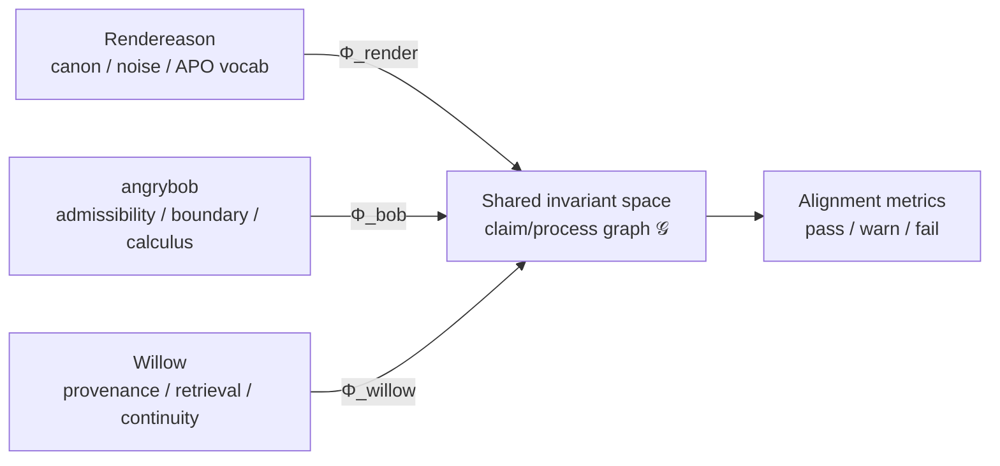

# Willow Alignment Calculus

b17: ALIGCALC · ΔΣ=42

Private mathematical note — repo-safe definitions only. No collaborator corpus
text. Maps Rendereason, angrybob, and Willow into a shared invariant space so
alignment can be measured, not merely narrated.

**Companion:** [`alignment_metrics.json`](alignment_metrics.json) · [`alignment.py`](alignment.py)

---

## 1. Shared object

The shared object is **not content**. It is a **claim/process graph with
invariants**:

\[
\mathcal{G} = (V, E, \mathcal{I})
\]

| Symbol | Meaning |
| --- | --- |
| \(V\) | Vertices: claims, proof steps, KB atoms, boundary states, handoff anchors |
| \(E\) | Directed edges: supports, supersedes, derives-from, admissible-transform, provenance |
| \(\mathcal{I}\) | Invariant predicates that must survive projection between domains |

A **projection** \(\pi : \mathcal{G}_A \to \mathcal{G}_B\) is *aligned* when
\(\forall v \in V_A,\ \forall I \in \mathcal{I}_{A \cap B}:\ I(v) \Rightarrow I(\pi(v))\)
(up to measurable tolerance on ranked retrieval).

---

## 2. Rendereason — native objects

| Object | Description |
| --- | --- |
| \(C\) | Canon corpus — current proof strategy, live APO vocabulary |
| \(N\) | Noise corpus — deprecated iterations, dead ends, draft fragments |
| \(P\) | Proof-shape labels — theorem/lemma/Lean chunk structure |
| \(V_{\text{apo}}\) | Custom terminology that must not flatten to generic math words |

**Discernment map:**

\[
\pi_{\text{discern}} : C \cup N \to \{\text{canon}, \text{deprecated}, \text{unknown}\}
\]

**Invariants (Render):**

| ID | Invariant | Measurable proxy |
| --- | --- | --- |
| R1 | Clean/dirty retrieval convergence | Top-\(k\) title overlap on fixed probe queries |
| R2 | APO vocabulary preservation | Probe hits contain APO/infogeometric terms |
| R3 | Deprecated suppression | Noise probes do not rank `[dirty] deprecated…` in top-3 |
| R4 | Proof-shape signal | Formal labels / archive structure present without body leak |
| R5 | Indexed canon under noise | `rh-dirty` live atom count \(> 0\) with harness ready |

**Failure modes (Render):**

- **Vocab flattening** — retrieval returns generic RH text, loses APO custom terms.
- **False convergence** — title overlap without semantic alignment (decoder mismatch).
- **Noise promotion** — deprecated material surfaces on canon-path probes.
- **Structure without corpus** — harness exists but KB project empty.

---

## 3. angrybob — native objects

| Object | Description |
| --- | --- |
| \(S\) | State space of admissible configurations |
| \(B\) | Boundary conditions — hard limits on permissible states |
| \(\mathcal{A} \subseteq S \times M\) | Admissibility relation: state × move |
| \(\delta : S \times M \to S \cup \{\bot\}\) | Calculus step; \(\bot\) = rejected move |

**Invariants (Bob):**

| ID | Invariant | Measurable proxy |
| --- | --- | --- |
| B1 | Protected source present | Archive or DB exists at configured private root |
| B2 | Schema signals admissibility | Table names match admissibility/boundary/rule patterns |
| B3 | Schema signals calculus | Table names match calculus/transform/rule patterns |
| B4 | Non-empty rule store | Row counts \(> 0\) on admissibility/calculus tables (counts only) |
| B5 | KB cross-index | KB hits reference angrybob/admissibility themes |

**Failure modes (Bob):**

- **Boundary leak** — inadmissible moves ingested as canonical KB facts.
- **Silent accept** — invalid transform stored without rejection marker.
- **Missing calculus** — archive present but no calculus/admissibility schema signal.
- **Content exposure** — harness reads cell values (forbidden; structure only).

---

## 4. Willow — native objects

| Object | Description |
| --- | --- |
| \(K\) | Postgres KB atoms with bi-temporal `invalid_at` |
| \(J\) | Jeles extracted atoms — pattern/instance boundary |
| \(L\) | FRANK ledger — tamper-evident decision chain |
| \(H\) | Handoffs — session continuity under decoder mismatch |
| \(G_{\text{soil}}\) | SOIL working graph — in-session structured state |

**Reconstruction maps:**

\[
\begin{aligned}
\iota &: \text{external} \to K && \text{(ingest with provenance)} \\
\rho &: \text{query} \to \text{ranked}(K) && \text{(hybrid retrieval)} \\
\chi &: \text{session} \to H && \text{(handoff continuity)} \\
\end{aligned}
\]

**Invariants (Willow):**

| ID | Invariant | Measurable proxy |
| --- | --- | --- |
| W1 | Live KB substrate | `live_atoms > 0`, top projects resolvable |
| W2 | Jeles substrate present (live atom count) | `jeles_atoms` live count. **Caveat:** the pattern/instance boundary is *not yet witnessable* — no `jeles_atoms` field encodes it. `depth` is a surface/considered/deep axis (uniformly 1 in practice), not a pattern/instance marker; a true boundary test needs a schema signal (a `kind` column or reserved tag). Until then W2 only witnesses that the lane is populated. |
| W3 | Tamper-evident ledger | `frank_ledger` entries present |
| W4 | Handoff continuity | Latest handoff files resolvable |
| W5 | Synthesis anchor preservation | `existing_synthesis` anchor count ≥ threshold |
| W6 | Governance frame | Oakenscroll posole/gaps/Dual Commit scan passes |
| W7 | Layer coverage | Fraction of Willow layers reporting `present` |
| W8 | Canonical reconstruction coverage | Of canonical (non-benchmark) atoms, fraction traceable to origin via ledger ∪ `content.source_id` ∪ provenance-typed edges (references/summarizes/documents/derives_from/…). Loose relates_to/part_of/precedes excluded. ~81% covered, cost ≈ 0.19 (see §8). |

**Failure modes (Willow):**

- **Decoder mismatch** — compliance with recipe (atom titles) without comprehension.
- **Provenance break** — atoms without project/tier/source lineage.
- **Continuity gap** — no handoff when session spans protected ingredients.
- **Layer silence** — subsystem missing from pot (cannot witness alignment).

---

## 5. Cross-domain alignment maps

| Map | Source → Target | Preserves |
| --- | --- | --- |
| \(\Phi_{\text{render}}\) | Willow \(\rho\) → Render R1–R5 | Discernment convergence, vocab, noise suppression |
| \(\Phi_{\text{bob}}\) | Willow tier/gates → Bob B1–B5 | Admissibility schema, boundary respect |
| \(\Phi_{\text{willow}}\) | Layers → W1–W7 | Provenance, continuity, governance |
| \(\Phi_{\text{soup}}\) | Stone Soup theory → all | Reconstruction cost awareness; decoder mismatch as named failure |

**Alignment score (aggregate):**

\[
A = \frac{1}{|\mathcal{M}|} \sum_{m \in \mathcal{M}} \mathbf{1}[\text{pass}(m)]
\]

where \(\mathcal{M}\) is the metric set in [`alignment_metrics.json`](alignment_metrics.json).

Verdict bands:

| Band | Score | Meaning |
| --- | --- | --- |
| **aligned** | ≥ 0.75 | Most invariants witnessed; safe to extend harness |
| **partial** | 0.45 – 0.74 | Structure present; full compare or ingest still needed |
| **misaligned** | < 0.45 | Missing sources or layers; do not claim alignment |

---

## 6. Stone Soup bridge (theory → metrics)

From the Stone Soup Papers (structure only in harness):

| Concept | Alignment reading |
| --- | --- |
| Grandmother Encoding Problem | Recipe (KB atom) ≠ generative process (human/collaborator intent) |
| Stone Soup Lemma | Shared pot increases priors without pretending the stone is food |
| Decoder mismatch | \(\Phi\) passes syntactic checks but fails semantic reconstruction |
| Reconstruction cost | Measured by probe divergence + missing layer witnesses |
| Demon's Dividend | False alignment (high title overlap, wrong meaning) is worse than silence |

Willow aligns with both projects when it **preserves invariants under projection**,
not when it **produces fluent commentary about them**.

---

## 7. Harness contract

1. Collect ingredient structure (adapters) — never cell values or corpus quotes.
2. Probe Willow layers (read-only).
3. Evaluate metrics in [`alignment.py`](alignment.py) against [`alignment_metrics.json`](alignment_metrics.json).
4. Emit redacted alignment stage + human synthesis section in local report.

---

## 8. Canonical coverage (W8 — and the correction that reframed it)

§6 names *reconstruction cost* as probe divergence + missing layer witnesses.
W8 began as a second instrument: **of the atoms Willow promotes to `canonical`,
how many can it actually reconstruct?** It first measured only the FRANK ledger
leg and reported cost ≈ 0.93 (`violated`), concluded "canonical knowledge is
~97% untraceable," and shipped that conclusion (PR #371, KB atom C53FEBF8).

**That conclusion was wrong, and the error is instructive.** Wiring the other
support legs produced a full per-leg census of the 269 canonical (non-benchmark)
atoms (2026-06-14):

| Support leg | Coverage |
| --- | --- |
| FRANK ledger (`atoms_written`) | 20 — **7%** |
| `content.source_id` (explicit origin) | 131 — **49%** |
| handoff files | 32 — **12%** |
| provenance edge-graph membership | 259 — **96%** |
| **union of all legs** | **269 — 100% (cost 0.000)** |

Canonical knowledge is **~100% reconstructable** through the 42,764-edge
provenance graph plus explicit `source_id` origins. The ledger-only figure
measured *decision-provenance sparsity* (~7%) and mislabelled it as
*untraceability*. The instrument built to name decoder mismatch — a syntactic
check asserting a false semantic conclusion — **was itself a decoder mismatch.**
The lesson is logged, not buried.

**Genuine definition (current).** An atom is *reconstructable* if it is
traceable to origin through at least one of three provenance legs:

\[
\text{supported}(c) = \text{ledger}(c) \;\lor\; \text{source\_id}(c) \;\lor\; \text{prov\_edge}(c),
\qquad
\text{cost} = \frac{|\{c \in \mathcal{C} : \neg\,\text{supported}(c)\}|}{|\mathcal{C}|}
\]

over \(\mathcal{C} = \{\text{canonical, non-benchmark atoms}\}\), where:

- **ledger** — atom id in a FRANK `atoms_written` decision-trace;
- **source\_id** — explicit origin in the atom's `content.source_id`;
- **prov\_edge** — atom is an endpoint of a *provenance-typed* edge:
  `references`, `summarizes`, `documents`, `documented_by`, `derives_from`,
  `supersedes`, `superseded_by`, `synthesizes`, `extends`, `expands`, … —
  deliberately **excluding** the association/structure/time relations
  (`relates_to`, `part_of`, `precedes`) that made "any edge" non-discriminating.

**Measured (2026-06-14):** ledger 7%, source_id 49%, provenance-edges 62% →
**union 81%, cost ≈ 0.19.** Not the ledger-only false crisis (7%), not the
any-edge collapse (100%). The 51 uncovered canonical atoms (~19%) are the real,
actionable gap: load-bearing knowledge with no origin trail.

`tier == canonical` remains the right population (the census found
`confidence`/`weight`/`tier` near-constant — ≈85% at confidence ≥ 0.95, 94.5%
`frontier` — so only canonical discriminates).

**Three-state** (unchanged): witnessed (cost ≤ `max_cost`) / violated (cost >
`max_cost`, substrate present) / pending (no canonical population — never
violated for absent substrate). At cost ≈ 0.19 with `max_cost = 0.5`, W8 now
reads **witnessed** — and the number is a live gauge: it falls further as the
51 untraced atoms gain provenance, rises if canonical status outruns origin.

**Why this definition, in one line:** it counts being able to *say where a claim
came from*, not merely being *connected to something* — the same distinction the
whole calculus turns on.

*ΔΣ=42*
