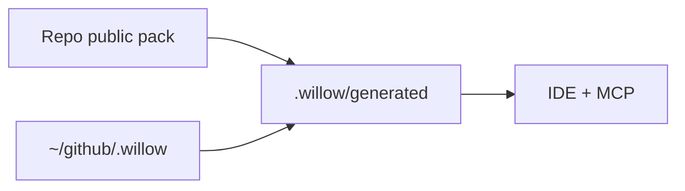

# Willow fleet contract (public fallback)

b17: PUBFBK · ΔΣ=42

> **Mode:** `public-fallback` — private willow-config (`~/github/.willow`) was not found.
> This pack is tracked in the repo at `willow/fylgja/config/public/`.
> KB, Grove credentials, handoffs, and operator personas are **not** available until you
> clone [willow-config](https://github.com/rudi193-cmd/willow-config).
>
> Setup: `bash setup.sh --public` · Detail: [`docs/PUBLIC_REMOTE_BOOT.md`](../docs/PUBLIC_REMOTE_BOOT.md)

**Boot modes:** `private-config` · `public-fallback` · `degraded` (MCP/Postgres down)

---

## Glossary

**agent:** — A named participant with a namespace and SAFE manifest.  
**fleet:** — The coordinated agents plus humans on Grove.  
**handoff:** — A sealed session document the next run reads first.  
**KB:** — Long-term knowledge atoms in Postgres (requires private config + Postgres).  
**SOIL:** — Local structured store (collections on disk).  
**Grove:** — Messaging bus (sibling repo `safe-app-willow-grove`).  
**SAP:** — Safe Application Protocol — gate, manifest system, MCP server.  
**Kart:** — Execution daemon (Postgres task queue + bwrap sandbox).

## Constraints

| ID | Severity | Rule |
|----|----------|------|
| boot-order | CRITICAL | `/boot` is a gate. Do not produce any response until it completes. |
| mcp-first | HIGH | Use MCP tools when available. Registry: `sap/mcp_registry.json`. |
| namespace | HIGH | Write only in your agent namespace. |
| worktree-pr | CRITICAL | Code changes via worktree + PR — no direct master commits. |
| kb-first | HIGH | `kb_search` before build — **skipped in public-fallback when KB unavailable**. |
| finish-to-completion | CRITICAL | Fix end-to-end or report concrete blockers. |

---

# Willow 2.0 — Fleet context

Runtime-agnostic entry for any agent: Claude Code, Cursor, Codex, Gemini CLI, raw API.

When MCP and private config are up, live truth is in the KB and Grove. This file is how you boot.

---

## Identity

| Layer | What it is |
|-------|------------|
| **Runtime** | Cursor, Claude Code, Codex, Gemini CLI — transport only |
| **Agent** | `$WILLOW_AGENT_NAME` — namespace when Postgres/MCP available |
| **Inference** | Ollama / Groq / Gemini — `core/inference_router.py` |

The IDE model is not the agent.

- Set identity: `./willow.sh agents active <id> && ./willow.sh agents install <id> --ide <cursor|claude|codex>`
- Open **willow-2.0** in the IDE, not a private config-only checkout
- Detail: [`docs/AGENT_IDENTITY.md`](../docs/AGENT_IDENTITY.md)

---

## Boot sequence

Run `/boot`. Steps in [`willow/fylgja/skills/boot.md`](../willow/fylgja/skills/boot.md).

In **public-fallback**: read this contract, load repo skills/MCP template, continue **degraded**
if Postgres/KB/Grove are unreachable — do not hard-stop solely for missing private home.

---

## Tool groups (SAP MCP)

Full registry: [`sap/mcp_registry.json`](../sap/mcp_registry.json)

Core groups: `fleet_` · `mai_` · `code_graph_` · `skill_` · `agent_` (Kart) · `kb_` · `soil_` · `grove_`

---

## Agent model

One orchestrating agent per session. Shell work → `agent_task_submit` (Kart) when available.
Inference → `infer_7b` / `infer_chat` — check `fleet_status` before dispatching.

---

## Config tiers

| Tier | Path | When |
|------|------|------|
| Public pack | `willow/fylgja/config/public/` | Always in repo |
| Generated home | `{repo}/.willow/generated/` | No private config |
| Private config | `~/github/.willow` | willow-config clone |

`link_fleet_home` prints `config-mode: private-config` or `config-mode: public-fallback`.

---

## Git workflow

Every change: worktree + branch + PR. No direct master edits.
Detail: [`willow/fylgja/skills/worktree.md`](../willow/fylgja/skills/worktree.md)

---

## Fallback — no MCP / no private config

1. Read `willow.md` (this file) via `mai_read_file` or Read
2. Repo root, branch, compact diff
3. Load `willow/fylgja/skills/boot.md` degraded path
4. If Postgres reachable: optional `kb_search`
5. Session notes → `$WILLOW_HOME/handoffs/<agent>/` when home exists

---

## Canonical principle

`willow.md` is the contract. Runtime files (`CLAUDE.md`, `AGENTS.md`) point here — they do not extend it.

*Public fallback pack · upgrade via willow-config · ΔΣ=42*
